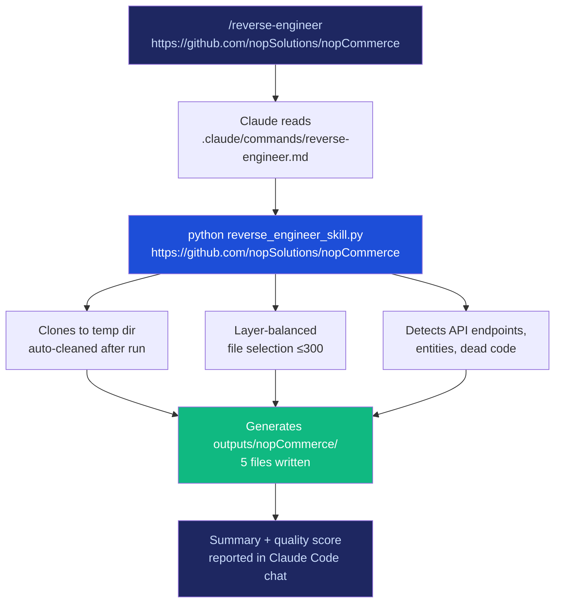

# Reverse Engineer Skill

> Clone any GitHub repository → complete static analysis → five professional output files in one command.

| Output | Audience | Format | Typical Size |
|--------|----------|--------|--------------|
| `{repo}_sdd.json` | Engineering tools, CI pipelines | SDD Framework JSON (13 sections) | 100–700 KB |
| `{repo}_dashboard.html` | Stakeholders, PMs, leadership | Self-contained Apple-theme HTML (6 sections) | 60–120 KB |
| `{repo}_report.md` | Architects, Confluence, Notion | GitHub-compatible Markdown (11 sections) | 15–40 KB |
| `{repo}_evaluation.md` | QA, developers | Automated 100-pt quality score | ~8 KB |
| `manifest.json` | Automation, CI | Run metrics and file index | ~1 KB |

**Supported languages:** Python · Java · C# / .NET · JavaScript · TypeScript (+ JSX/TSX)  
**AI sections** (executive summary, modernization roadmap) use `claude-sonnet-4-6` when `ANTHROPIC_API_KEY` is set — the tool produces full output without it.

---

## Table of Contents

1. [Prerequisites](#1-prerequisites)
2. [Installation](#2-installation)
3. [Run via CLI](#3-run-via-cli-fastest)
4. [Run via Claude Code](#4-run-via-claude-code)
5. [Run via GitHub Copilot Chat](#5-run-via-github-copilot-chat)
6. [Output Files](#6-output-files)
7. [Verify Output Quality](#7-verify-output-quality)
8. [Enable AI Sections](#8-enable-ai-sections)
9. [Project Structure](#9-project-structure)
10. [Engine Module Reference](#10-engine-module-reference)
11. [Improving the Skill](#11-improving-the-skill)
12. [Token Usage](#12-token-usage)

---

## 1. Prerequisites

```powershell
python --version    # need 3.8+
git --version       # need 2.x+
```

Download: [Python](https://www.python.org/downloads/) · [Git](https://git-scm.com/downloads)

---

## 2. Installation

```powershell
cd C:\path\to\reverse-eng-proj
pip install -r requirements.txt
```

`requirements.txt` installs one package:
- `anthropic>=0.40.0` — Anthropic Python SDK (AI sections only; heuristic fallbacks work without it)

---

## 3. Run via CLI (Fastest)

### Step by step

**Step 1** — Open a terminal in the project folder:

```powershell
# Windows PowerShell
cd C:\Users\YourName\Downloads\reverse-eng-proj
```

```bash
# macOS / Linux
cd ~/Downloads/reverse-eng-proj
```

**Step 2** — *(Optional)* Set your Anthropic API key to unlock AI-powered sections:

```powershell
$env:ANTHROPIC_API_KEY = "sk-ant-api03-..."   # PowerShell (current session)
```

```bash
export ANTHROPIC_API_KEY="sk-ant-api03-..."    # bash / macOS
```

**Step 3** — Run against any public GitHub repo:

```bash
python reverse_engineer_skill.py https://github.com/nopSolutions/nopCommerce
```

**Expected output** (nopCommerce example):

```
============================================================
  Reverse Engineer Skill
  Repository: https://github.com/nopSolutions/nopCommerce
============================================================

[1/8] Cloning repository...
  Cloning https://github.com/nopSolutions/nopCommerce -> C:\Temp\rev_eng_abc\nopCommerce
  [ok] Clone complete

[2/8] Loading source files...
      Found 3114 source files

[3/8] Parsing code structures...
      Capped to 292 files (layer-balanced: ctrl/svc/repo/domain/model)
      Parsed 292 / 292 files

[4/8] Generating metrics report...

[5/8] Extracting APIs and detecting dead code...
      284 API endpoints | 241 dead files | 7 tech stack items
      51 data entities | 0 relationships detected

[6/8] Running AI analysis (Claude claude-sonnet-4-6)...
      Architecture: Monolithic | Priority: HIGH
      Platform: .NET / Windows Server | Layers: 6 | Data boundaries: 7

[7/8] Generating 3 output files...
      [ok] SDD JSON       -> outputs\nopCommerce\nopCommerce_sdd.json
      [ok] HTML Dashboard -> outputs\nopCommerce\nopCommerce_dashboard.html
      [ok] MD Report      -> outputs\nopCommerce\nopCommerce_report.md

[8/8] Evaluating pipeline output quality...
      [ok] Evaluation Report -> outputs\nopCommerce\nopCommerce_evaluation.md

[9/9] Complete!

  Output files:
     * outputs\nopCommerce\nopCommerce_sdd.json          (415 KB)
     * outputs\nopCommerce\nopCommerce_dashboard.html    (96 KB)
     * outputs\nopCommerce\nopCommerce_report.md         (34 KB)
     * outputs\nopCommerce\nopCommerce_evaluation.md     (8 KB)
     * outputs\nopCommerce\manifest.json                 (1 KB)

  Analysis summary:
     Files analyzed    : 292
     Classes found     : 284
     Methods found     : 2301
     API endpoints     : 284
     Dead code files   : 241
     Primary language  : dotnet
     Tech stack        : .NET Project File, ASP.NET Core, Docker

  Quality evaluation:
     Evaluation Score  : 78/100 pts  [MEDIUM confidence]
       1. Parsing Quality                        18/20 pts
       2. API Endpoint Detection                 18/20 pts
       3. Dead Code Analysis                     12/15 pts
       4. Entity / Data Architecture             10/15 pts
       5. Dependency Graph                       15/15 pts
       6. AI Analysis Quality                     5/15 pts  ← no API key
```

**Step 4** — Open the dashboard:

```powershell
start outputs\nopCommerce\nopCommerce_dashboard.html    # Windows
open  outputs/nopCommerce/nopCommerce_dashboard.html    # macOS
```

---

## 4. Run via Claude Code

### Step by step

**Step 1** — Install Claude Code (if not already installed):

```bash
npm install -g @anthropic-ai/claude-code
```

**Step 2** — Open Claude Code in the project directory:

```bash
cd C:\path\to\reverse-eng-proj
claude
```

**Step 3** — Type the slash command:

```
/reverse-engineer https://github.com/nopSolutions/nopCommerce
```

**What happens internally:**



> **Important:** The slash command runs `python reverse_engineer_skill.py` directly — it does **not** run `git clone` separately first. The script handles cloning internally. If you see Claude trying to clone manually, your command file may be out of date.

---

## 5. Run via GitHub Copilot Chat

### Prerequisites

- VS Code with **GitHub Copilot** + **GitHub Copilot Chat** extensions installed and signed in
- This project folder open as the VS Code workspace

### Option A — Custom Prompt (Recommended)

**Step 1** — Open VS Code in this project:
```bash
code C:\path\to\reverse-eng-proj
```

**Step 2** — Open Copilot Chat: `Ctrl+Alt+I` (Windows) / `Cmd+Alt+I` (macOS)

**Step 3** — Attach the custom prompt:
- Click the **paperclip / attach** icon in the chat input
- Select **Prompt…**
- Choose **"Reverse Engineer a GitHub Repo"**

**Step 4** — Paste the GitHub URL and press Enter:
```
https://github.com/nopSolutions/nopCommerce
```

Copilot will open a terminal, execute `reverse_engineer_skill.py`, and report results in the chat.

---

### Option B — Natural Language

Copilot auto-loads `.github/copilot-instructions.md` when this workspace is open. Just type:

```
Analyze https://github.com/nopSolutions/nopCommerce and generate the SDD, dashboard, and report.
```

---

### Option C — Troubleshooting (Prompt Not Showing)

Check `.vscode/settings.json` contains:

```json
{
  "chat.promptFiles": true,
  "chat.promptFilesLocations": { ".github/prompts": true }
}
```

Then reload VS Code: `Ctrl+Shift+P` → **Reload Window**.

---

## 6. Output Files

All outputs land in `./outputs/{repo-name}/` — five files always.

### `{repo}_sdd.json` — System Design Document

JSON with 13 top-level sections:

| Section | Contents |
|---------|----------|
| `sdd_metadata` | Version, timestamp, generator |
| `project` | Name, URL, language, tech stack, platform, architecture layers |
| `executive_summary` | Purpose, architecture pattern, tech debt, priority |
| `codebase_metrics` | Files, classes, methods, endpoints, language breakdown |
| `architecture` | Style, layers, components, Mermaid dependency graph |
| `module_inventory` | Per-file list: classes, methods, routes (all parsed files) |
| `api_catalog` | OpenAPI 3.0 spec + flat endpoint list |
| `dependency_analysis` | Import map, top 10 most-connected modules |
| `dead_code_analysis` | Unreferenced files and classes |
| `data_architecture` | ORM entities, relationships, microservice data boundaries |
| `modernization_roadmap` | Phased plan with effort estimates and risk levels |
| `risk_assessment` | Risk items with severity and mitigation |
| `tech_debt_inventory` | Specific debt categories with priority |

### `{repo}_dashboard.html` — Stakeholder Dashboard

Open directly in any browser — no server required. Six sidebar sections:

- **Overview** — metric cards with count-up animation, language bar chart, system summary, tech stack badges, most-connected-modules bar
- **Architecture** — Mermaid dependency graph (light theme), architectural layer list
- **API Endpoints** — live search/filter input, HTTP method colour badges, full endpoint table
- **Dead Code** — SVG percentage ring showing % of dead files, unreferenced file/class lists
- **Modernization** — vertical timeline for migration phases, microservice boundary grid, target stack badges
- **Data Architecture** — vis.js entity network graph (colored by bounded context), entity table, boundary cards

### `{repo}_report.md` — Technical Report

GitHub / Confluence / Notion compatible Markdown. 11 sections + appendix, with Mermaid diagrams.

### `{repo}_evaluation.md` — Quality Evaluation

Automated 100-point pipeline quality score. Generated after every run:

```
Score: 82/100  Confidence: HIGH

1. Parsing Quality            18/20  ✅ PASS
2. API Endpoint Detection     18/20  ✅ PASS
3. Dead Code Analysis         12/15  ✅ PASS
4. Entity / Data Architecture 10/15  ⚠️ WARN  (0 relationships via Fluent API)
5. Dependency Graph           15/15  ✅ PASS
6. AI Analysis Quality        15/15  ✅ PASS
```

See `EVALUATION.md` in the project root for the full interpretation guide.

### `manifest.json` — Run Manifest

Machine-readable run record:

```json
{
  "generated_at": "2026-05-26T10:30:00Z",
  "repo_name": "nopCommerce",
  "output_directory": "outputs/nopCommerce",
  "files_written": [
    { "file": "nopCommerce_sdd.json",        "type": "json", "size": 424960 },
    { "file": "nopCommerce_dashboard.html",  "type": "text", "size": 98304  },
    { "file": "nopCommerce_report.md",       "type": "text", "size": 34816  },
    { "file": "nopCommerce_evaluation.md",   "type": "text", "size": 8192   },
    { "file": "manifest.json",               "type": "json", "size": 1024   }
  ],
  "metrics": {
    "files_analyzed": 292, "classes": 284,
    "methods": 2301, "api_endpoints": 284,
    "dead_files": 241, "primary_language": "dotnet"
  }
}
```

---

## 7. Verify Output Quality

Run these checks after any pipeline execution:

```powershell
# 1. Confirm all 5 files exist
ls outputs\nopCommerce\

# 2. Validate JSON
python -c "import json; json.load(open('outputs/nopCommerce/nopCommerce_sdd.json', encoding='utf-8')); print('JSON valid')"

# 3. Check no unfilled placeholders in HTML
python -c "
html = open('outputs/nopCommerce/nopCommerce_dashboard.html', encoding='utf-8').read()
assert '%%' not in html, 'Found unfilled placeholders!'
print('HTML clean')
"

# 4. Print key metrics from manifest
python -c "
import json
m = json.load(open('outputs/nopCommerce/manifest.json', encoding='utf-8'))
print(m['metrics'])
"

# 5. View evaluation score
python -c "
import re
txt = open('outputs/nopCommerce/nopCommerce_evaluation.md', encoding='utf-8').read()
score = re.search(r'(\d+)/100 pts', txt)
if score: print('Evaluation score:', score.group(0))
"
```

For a deep quality review, open `outputs/{repo}/{repo}_evaluation.md` — it contains PASS/WARN/FAIL checks for every analysis section with actionable recommendations.

---

## 8. Enable AI Sections

Without an API key, executive summary and modernization roadmap use smart heuristic fallbacks.  
With a key, `claude-sonnet-4-6` generates richer, context-aware content.

```powershell
# PowerShell — current session
$env:ANTHROPIC_API_KEY = "sk-ant-api03-..."

# PowerShell — persist across all sessions
[System.Environment]::SetEnvironmentVariable("ANTHROPIC_API_KEY","sk-ant-api03-...","User")
```

```bash
# bash — current session
export ANTHROPIC_API_KEY="sk-ant-api03-..."

# bash — persist (add to ~/.bashrc or ~/.zshrc)
echo 'export ANTHROPIC_API_KEY="sk-ant-api03-..."' >> ~/.bashrc
```

Get a key: <https://console.anthropic.com/>

---

## 9. Project Structure

```
reverse-eng-proj/
│
├── reverse_engineer_skill.py       42 lines  — CLI entry point
├── requirements.txt                1 dep     — anthropic>=0.40.0
├── README.md                       This file
├── ARCHITECTURE.md                 Deep-dive: code, data flow, design decisions
├── EVALUATION.md                   Guide to interpreting evaluation.md outputs
│
├── engine/                         Modular Python package (v3.0.0)
│   ├── __init__.py                 Package exports + version string (3.0.0)
│   ├── loaders.py                  File discovery — SUPPORTED_EXTENSIONS, SKIP_DIRS, load_repo()
│   ├── parsers.py                  5 language parsers + ORM entity extractors
│   ├── analyzer.py                 13 analysis functions: metrics, graph, APIs, dead code,
│   │                               tech stack, platform, layers, entities, boundaries
│   ├── ai_analysis.py              Claude API wrapper + heuristic fallbacks
│   ├── output_manager.py           OutputManager class — write files, track sizes
│   ├── evaluator.py                100-pt pipeline quality scorer + Markdown writer
│   ├── pipeline.py                 9-stage orchestrator
│   └── generators/
│       ├── __init__.py             Package init
│       ├── sdd.py                  SDD JSON builder (13 sections)
│       ├── report.py               Markdown report builder (11 sections)
│       └── dashboard.py            Apple-theme HTML dashboard (6 sidebar sections)
│
├── templates/                      Development reference only — NOT read at runtime
│   ├── sdd_template.json           SDD schema with placeholder comments
│   ├── dashboard_template.html     Dashboard design reference with DATA object docs
│   └── report_template.md          Report structure reference
│
├── .claude/
│   └── commands/
│       └── reverse-engineer.md     /reverse-engineer slash command definition
│
├── .github/
│   ├── copilot-instructions.md     Auto-loaded context for GitHub Copilot Chat
│   └── prompts/
│       ├── reverse-engineer.prompt.md   Agent prompt (mode: agent)
│       └── improve-parser.prompt.md     Parser extension guide (mode: ask)
│
└── .vscode/
    └── settings.json               Copilot + custom prompt file settings
```

---

## 10. Engine Module Reference

| Module | Key exports | Responsibility |
|--------|------------|----------------|
| `engine.loaders` | `load_repo`, `SUPPORTED_EXTENSIONS`, `SKIP_DIRS` | Walk repo, read source files |
| `engine.parsers` | `parse_file`, `parse_python`, `parse_java`, `parse_dotnet`, `parse_js_ts` | Extract classes, methods, imports, routes, ORM entities |
| `engine.analyzer` | `generate_report`, `build_dependency_map`, `generate_mermaid`, `extract_api_endpoints`, `generate_openapi_spec`, `detect_dead_code`, `detect_tech_stack`, `detect_platform`, `detect_architecture_layers`, `find_top_modules`, `extract_external_deps`, `detect_database_schema`, `suggest_microservice_data_boundaries` | All static analysis |
| `engine.ai_analysis` | `ai_executive_summary`, `ai_modernization_roadmap` | Claude API + fallbacks |
| `engine.output_manager` | `OutputManager` | Write files, track sizes, emit manifest |
| `engine.evaluator` | `evaluate_pipeline_output`, `write_evaluation_md` | 100-pt quality scoring engine |
| `engine.pipeline` | `run_pipeline`, `clone_repo`, `repo_name_from_url` | 9-stage orchestrator |
| `engine.generators.sdd` | `generate_sdd` | Build SDD JSON dict (13 sections) |
| `engine.generators.dashboard` | `generate_html_dashboard` | Build Apple-theme HTML (6 sections) |
| `engine.generators.report` | `generate_md_report` | Build Markdown report (11 sections) |

### Parser return contract

Every `parse_X` function returns:

```python
{
    "file":         str,          # absolute path
    "language":     str,          # "python" | "java" | "dotnet" | "typescript" | "javascript"
    "classes":      list[str],    # class / interface names
    "methods":      list[str],    # method / function names (keywords excluded)
    "imports":      list[str],    # raw import strings
    "dependencies": list[str],    # deduplicated dependency namespaces
    "routes":       list[dict],   # [{path, methods, class, method}]
    "db_entities":  list[dict],   # [{name, table, fields, relationships, file}]
}
```

### File cap strategy (layer-balanced)

For repos with >300 source files, the pipeline uses a quota-based selection:

```
Layer 0 — Controllers  (≤75 files)   ← API surface always covered
Layer 1 — Services     (≤75 files)   ← Business logic always covered
Layer 2 — Repositories (≤40 files)   ← Data access always covered
Layer 3 — Domain/Entity(≤60 files)   ← ORM entities always covered
Layer 4 — Models/DTOs  (≤30 files)
Layer 5 — Everything else (≤20 files)
Cap total: 300 files
```

This replaces the old simple priority sort and ensures domain/entity files appear even in large enterprise repos where controllers + services alone exceed 300 files.

---

## 11. Improving the Skill

### Add a new language parser

1. Add the extension to `detect_language()` in `engine/parsers.py`
2. Add the extension to `SUPPORTED_EXTENSIONS` in `engine/loaders.py`
3. Write `parse_X(file_path, code) -> dict` returning the contract above (including `db_entities`)
4. Optionally write `_extract_db_entities_X(file_path, code, classes) -> list` for ORM entity detection
5. Add the dispatch case to `parse_file()`

Full example (Go parser) in `.github/prompts/improve-parser.prompt.md`.

### Adjust the file cap

Edit `SLOTS` in `engine/pipeline.py` to change per-layer quotas:

```python
SLOTS = {0: 75, 1: 75, 2: 40, 3: 60, 4: 30, 5: 20}  # total ≤ 300
```

Increase layer 3 if entity detection coverage is low for a specific repo.

### Coding conventions

- No external dependencies beyond `anthropic` (git is called via `subprocess`)
- All parsers use **regex only** — no AST library dependencies
- AI sections **degrade gracefully** when `ANTHROPIC_API_KEY` is not set
- All output files land in `./outputs/{repo_name}/` via `OutputManager`
- HTML dashboard is self-contained except CDN for Chart.js, Mermaid, and vis-network
- Python 3.8+ compatible syntax throughout
- Google-style docstrings on every module, class, and function
- All print statements use ASCII-safe characters (UTF-8 stdout wrapper handles the rest)

---

## 12. Token Usage

This project was built interactively using Claude AI across multiple Claude Code sessions.

### Runtime AI cost per analysis

Each `python reverse_engineer_skill.py <url>` run with `ANTHROPIC_API_KEY` set makes **2 API calls** (executive summary + modernization roadmap):

| Call | Input | Output | Cost |
|------|-------|--------|------|
| `ai_executive_summary` | ~800 tokens | ~400 tokens | ~$0.008 |
| `ai_modernization_roadmap` | ~900 tokens | ~600 tokens | ~$0.012 |
| **Per run** | | | **~$0.02** |

Running without `ANTHROPIC_API_KEY` costs **$0.00** — heuristic fallbacks are used.

Get a key: <https://console.anthropic.com/>  
Current pricing: <https://www.anthropic.com/pricing>
