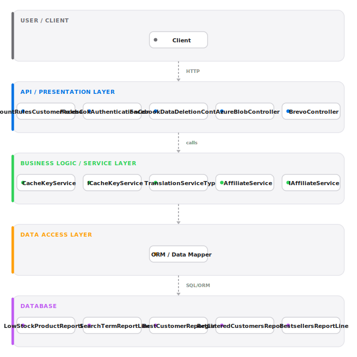
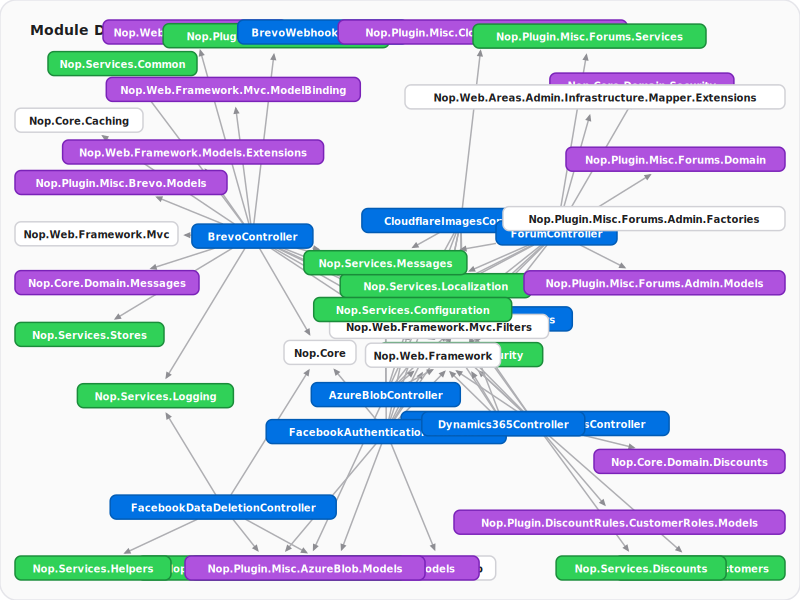

# nopCommerce — Reverse Engineering Report

> **Auto-generated** by the Reverse Engineer Skill (API-key-free static analysis) · 2026-05-26 10:34 UTC
> Repository: [https://github.com/nopSolutions/nopCommerce](https://github.com/nopSolutions/nopCommerce)
> Primary Language: **Dotnet**
> Analysis Engine: **Pure static heuristics — no API keys required**

---

## Table of Contents

1. [Executive Summary](#1-executive-summary)
2. [Business Logic & Functional Overview](#2-business-logic--functional-overview)
3. [Codebase Metrics](#3-codebase-metrics)
4. [Architecture Overview](#4-architecture-overview)
5. [Module Inventory](#5-module-inventory)
6. [API Catalog](#6-api-catalog)
7. [Dependency Analysis](#7-dependency-analysis)
8. [Dead Code Analysis](#8-dead-code-analysis)
9. [Tech Debt Inventory](#9-tech-debt-inventory)
10. [Modernization Roadmap](#10-modernization-roadmap)
11. [Data Architecture & Microservices Decomposition](#11-data-architecture--microservices-decomposition)
12. [Risk Assessment](#12-risk-assessment)

---

## 1. Executive Summary
nopCommerce is an open-source .NET e‑commerce platform providing a storefront, admin console, and a large plugin ecosystem for merchants to sell products online and manage orders, payments, catalogs, promotions, taxes and integrations.

| Attribute | Value |
|-----------|-------|
| **Architecture Pattern** | MVC Monolith |
| **Modernization Priority** | HIGH |
| **Platform** | .NET / Windows Server |
| **Tech Stack** | `.NET`, `ASP.NET Core`, `Docker`, `Docker Compose`, `nopCommerce` |
| **Total Files (sample)** | 292 |
| **Total Classes (sample)** | 231 |
| **Total Methods (sample)** | 1452 |

**Why High Priority:**
- Large codebase surface (many controllers and plugins) with 284 extracted API endpoints and numerous third‑party integrations increases risk and maintenance cost.
- Significant coupling between controllers, services and plugins makes incremental change and safe decomposition more difficult without added test coverage and clear API contracts.

**Top Tech Debt Concerns:**
- Plugin coupling and mixed responsibilities in the monolith — plugins are implemented inside the same process and controllers contain high method counts.
- Dead/unused code: static analysis flagged many unreferenced files (manual validation required before removal).
- Limited automated test harness visible in the analyzed subset — increases regression risk during refactor.

**Quick Recommendation:** Prioritise dependency/CVE audit, add CI and tests for checkout and admin flows, then incrementally extract clear service boundaries.
---

## 2. Business Logic & Functional Overview

> The sections below explain what nopCommerce does from an end‑user perspective (not implementation details).

**Business Domain:** E‑Commerce / Online Retail

### What It Does (end‑user view)

nopCommerce provides a public storefront where shoppers can discover and buy products, and an administrative backoffice where merchants manage catalog, orders, promotions, payments and store settings. Customers browse categories and products, add items to a cart, complete checkout with a chosen payment method, and track order status. Admins create/edit products and categories, manage discounts and taxes, configure payment and shipping integrations, and review reports and logs.

For businesses, nopCommerce supports B2C and B2B workflows (quotes/RFQ, bulk imports), plugin-based integrations (payment gateways, tax providers, analytics), and operational utilities (backups, cache and maintenance tasks).

### Core Workflows (concise)
1. **Product Browse & Discovery** — Trigger: customer visits site or searches. Steps: view category → list → product details → add to cart. Key controllers: `CategoryController`, catalog services.
2. **Checkout & Payment** — Trigger: customer checks out. Steps: validate cart → choose shipping → apply discounts/taxes → create order → call payment gateway → confirm order. Key controllers: `PayPalCommercePublicController`, payment plugins, tax controllers (Avalara).
3. **Admin Catalog Management** — Trigger: admin edits catalog. Steps: create/edit categories/products → import/export → publish. Key controllers: `CategoryController`, `ManufacturerController`.
4. **Quotes / RFQ (B2B)** — Trigger: customer requests a quote. Steps: build RFQ → admin reviews/creates quote → convert to order. Key controllers: `RfqCustomerController`, `RfqAdminController`.
5. **GDPR / Data Deletion** — Trigger: customer request or external provider webhook. Steps: validate deletion request → trigger data deletion flows → confirm status. Key controllers: `FacebookDataDeletionController`, GDPR services.

### User Roles
- Customer (end buyer)
- Guest (unauthenticated shopper)
- Admin / Store Operator
- Integrator / Plugin Author

### Key Business Rules
- Inventory must be validated during checkout to prevent oversell.
- Discounts/coupons apply according to scope (product/category/customer role) and priority rules.
- Taxes are calculated via configured tax providers (e.g., Avalara) and applied to orders before payment.
- Payment is processed by external gateways; webhooks reconcile asynchronous status updates.

### Entity Glossary (high level)
| Entity | Business Meaning |
|--------|-----------------|
| Product | A sellable catalog item with price, attributes, inventory and media. |
| Category | Logical grouping used for navigation and merchandising. |
| Customer | Registered shopper owning orders, addresses, and account settings. |
| Order | Confirmed purchase that records items, payments, shipments and status. |
| Cart | Temporary shopping basket before order creation. |
| Discount / Coupon | Promotional rule that modifies price or shipping. |
| Payment Token / Authorization | External gateway credential or saved instrument used for charging. |
| Quote / RFQ | Request-for-quote issued by a customer (B2B workflow). |
| Blog / Forum entities | Content and community features for marketing and engagement. |

### Integrations Detected
- Payment gateways (PayPalCommerce and others via plugins)
- Tax providers (Avalara)
- Cloud storage and media (Azure Blob, Cloudflare Images)
- External auth providers (Facebook, Google external auth)

---

---

## 3. Codebase Metrics

### Language Distribution

| Language | Files | Share |
|----------|-------|-------|
| Dotnet | 292 | 100% |

### Key Counts

| Metric | Value |
|--------|-------|
| Files Analyzed | **292** |
| Classes Defined | **231** |
| Methods & Functions | **1452** |
| API Endpoints Extracted | **284** |
| Unreferenced Files | **79** |
| Unreferenced Classes | **229** |
| External Dependencies | **100** |

---

## 4. Architecture Overview

**Pattern:** MVC Monolith

### Architectural Layers Detected

- API / Presentation Layer
- Business Logic Layer
- Configuration / Bootstrap Layer
- Data Access Layer
- Utility / Shared Layer
- View / Template Layer

### System Block Diagram



<details>
<summary><b>Show ASCII/Unicode Text Block Diagram (Offline View)</b></summary>

```text
┌──────────────────────────────────────────────────────────────────────┐
│                            USER / CLIENT                             │
├──────────────────────────────────────────────────────────────────────┤
│  • Client                                                            │
└──────────────────────────────────────────────────────────────────────┘
 
                                   │ (HTTP)
                                   ▼
 
┌──────────────────────────────────────────────────────────────────────┐
│                       API / PRESENTATION LAYER                       │
├──────────────────────────────────────────────────────────────────────┤
│  • DiscountRulesCustomerRolesController  • FacebookAuthenticationController  │
│  • FacebookDataDeletionController   • AzureBlobController              │
│  • BrevoController                                                   │
└──────────────────────────────────────────────────────────────────────┘
 
                                   │ (calls)
                                   ▼
 
┌──────────────────────────────────────────────────────────────────────┐
│                    BUSINESS LOGIC / SERVICE LAYER                    │
├──────────────────────────────────────────────────────────────────────┤
│  • CacheKeyService                  • ICacheKeyService                 │
│  • TranslationServiceType           • AffiliateService                 │
│  • IAffiliateService                                                 │
└──────────────────────────────────────────────────────────────────────┘
 
                                   │
                                   ▼
 
┌──────────────────────────────────────────────────────────────────────┐
│                          DATA ACCESS LAYER                           │
├──────────────────────────────────────────────────────────────────────┤
│  • ORM / Data Mapper                                                 │
└──────────────────────────────────────────────────────────────────────┘
 
                                   │ (SQL/ORM)
                                   ▼
 
┌──────────────────────────────────────────────────────────────────────┐
│                               DATABASE                               │
├──────────────────────────────────────────────────────────────────────┤
│  • LowStockProductReportLine        • SearchTermReportLine             │
│  • BestCustomerReportLine           • RegisteredCustomersReportLine    │
│  • BestsellersReportLine                                             │
└──────────────────────────────────────────────────────────────────────┘
```
</details>

<details>
<summary><b>Show Graphviz DOT Source Code (Developer View)</b></summary>


</details>

```dot
digraph G {
  rankdir=TB;
  splines=ortho;
  nodesep=0.4;
  ranksep=0.5;
  bgcolor="transparent";
  node [shape=box, style="filled,rounded", fontname="Helvetica", fontsize=11, fillcolor="#f5f5f7", fontcolor="#1d1d1f", penwidth=1.5];
  edge [color="#8e8e93", fontname="Helvetica", fontsize=9, fontcolor="#8e8e93", arrowhead=vee, arrowsize=0.7];
  subgraph cluster_0 {
    label = "User / Client";
    color = "#6e6e73";
    style = "dashed,rounded";
    fontname = "Helvetica";
    fontsize = 12;
    fontcolor = "#6e6e73";
    penwidth = 2.0;
    "client_node" [label="Client", fillcolor="#6e6e73", fontcolor="#ffffff", style="filled,rounded", penwidth=0];
  }
  subgraph cluster_1 {
    label = "API / Presentation Layer";
    color = "#0071e3";
    style = "dashed,rounded";
    fontname = "Helvetica";
    fontsize = 12;
    fontcolor = "#0071e3";
    penwidth = 2.0;
    "DiscountRulesCustomerRolesController" [label="DiscountRulesCustomerRolesController", fillcolor="#0071e3", fontcolor="#ffffff", style="filled,rounded", penwidth=0];
    "FacebookAuthenticationController" [label="FacebookAuthenticationController", fillcolor="#0071e3", fontcolor="#ffffff", style="filled,rounded", penwidth=0];
    "FacebookDataDeletionController" [label="FacebookDataDeletionController", fillcolor="#0071e3", fontcolor="#ffffff", style="filled,rounded", penwidth=0];
    "AzureBlobController" [label="AzureBlobController", fillcolor="#0071e3", fontcolor="#ffffff", style="filled,rounded", penwidth=0];
    "BrevoController" [label="BrevoController", fillcolor="#0071e3", fontcolor="#ffffff", style="filled,rounded", penwidth=0];
  }
  subgraph cluster_2 {
    label = "Business Logic / Service Layer";
    color = "#30d158";
    style = "dashed,rounded";
    fontname = "Helvetica";
    fontsize = 12;
    fontcolor = "#30d158";
    penwidth = 2.0;
    "CacheKeyService" [label="CacheKeyService", fillcolor="#30d158", fontcolor="#ffffff", style="filled,rounded", penwidth=0];
    "ICacheKeyService" [label="ICacheKeyService", fillcolor="#30d158", fontcolor="#ffffff", style="filled,rounded", penwidth=0];
    "TranslationServiceType" [label="TranslationServiceType", fillcolor="#30d158", fontcolor="#ffffff", style="filled,rounded", penwidth=0];
    "AffiliateService" [label="AffiliateService", fillcolor="#30d158", fontcolor="#ffffff", style="filled,rounded", penwidth=0];
    "IAffiliateService" [label="IAffiliateService", fillcolor="#30d158", fontcolor="#ffffff", style="filled,rounded", penwidth=0];
  }
  subgraph cluster_3 {
    label = "Data Access Layer";
    color = "#ff9f0a";
    style = "dashed,rounded";
    fontname = "Helvetica";
    fontsize = 12;
    fontcolor = "#ff9f0a";
    penwidth = 2.0;
    "orm_node" [label="ORM / Data Mapper", fillcolor="#ff9f0a", fontcolor="#ffffff", style="filled,rounded", penwidth=0];
  }
  subgraph cluster_4 {
    label = "Database";
    color = "#bf5af2";
    style = "dashed,rounded";
    fontname = "Helvetica";
    fontsize = 12;
    fontcolor = "#bf5af2";
    penwidth = 2.0;
    "db_LowStockProductReportLine" [label="LowStockProductReportLine", fillcolor="#bf5af2", fontcolor="#ffffff", style="filled,rounded", penwidth=0];
    "db_SearchTermReportLine" [label="SearchTermReportLine", fillcolor="#bf5af2", fontcolor="#ffffff", style="filled,rounded", penwidth=0];
    "db_BestCustomerReportLine" [label="BestCustomerReportLine", fillcolor="#bf5af2", fontcolor="#ffffff", style="filled,rounded", penwidth=0];
    "db_RegisteredCustomersReportLine" [label="RegisteredCustomersReportLine", fillcolor="#bf5af2", fontcolor="#ffffff", style="filled,rounded", penwidth=0];
    "db_BestsellersReportLine" [label="BestsellersReportLine", fillcolor="#bf5af2", fontcolor="#ffffff", style="filled,rounded", penwidth=0];
  }
  "client_node" -> "DiscountRulesCustomerRolesController" [label="HTTP"];
  "client_node" -> "FacebookAuthenticationController" [label="HTTP"];
  "client_node" -> "FacebookDataDeletionController" [label="HTTP"];
  "DiscountRulesCustomerRolesController" -> "CacheKeyService" [label="calls"];
  "FacebookAuthenticationController" -> "ICacheKeyService" [label="calls"];
  "FacebookDataDeletionController" -> "TranslationServiceType" [label="calls"];
  "AzureBlobController" -> "AffiliateService" [label="calls"];
  "orm_node" -> "db_LowStockProductReportLine" [label="SQL/ORM"];
}
```

> The block diagram above shows the detected architectural layers — controllers,
> services, repositories, database entities, and external integrations — auto-generated
> from static class name analysis. No AI or API key required.

### Module Dependency Graph

```dot
digraph G {
  rankdir=LR;
  splines=true;
  node [shape=box, style=filled, fillcolor="#aeaeb2", color="#8e8e93", fontcolor="#1d1d1f", fontname="Helvetica", fontsize=10];
  edge [color="#c7c7cc", fontname="Helvetica", fontsize=8];
  node_0 [label="DiscountRulesCustomerRolesController", fillcolor="#0071e3", color="#005bb5", fontcolor="#ffffff", shape="box"];
  node_1 [label="Nop.Web.Framework.Controllers", fillcolor="#0071e3", color="#005bb5", fontcolor="#ffffff", shape="box"];
  node_2 [label="Nop.Core.Domain.Discounts", fillcolor="#aeaeb2", color="#8e8e93", fontcolor="#1d1d1f", shape="ellipse"];
  node_3 [label="Nop.Web.Framework.Mvc.Filters", fillcolor="#aeaeb2", color="#8e8e93", fontcolor="#1d1d1f", shape="ellipse"];
  node_4 [label="Nop.Plugin.DiscountRules.CustomerRoles.Models", fillcolor="#aeaeb2", color="#8e8e93", fontcolor="#1d1d1f", shape="ellipse"];
  node_5 [label="Nop.Services.Localization", fillcolor="#30d158", color="#1a8c3a", fontcolor="#ffffff", shape="box"];
  node_6 [label="Nop.Services.Customers", fillcolor="#30d158", color="#1a8c3a", fontcolor="#ffffff", shape="box"];
  node_7 [label="Nop.Services.Discounts", fillcolor="#30d158", color="#1a8c3a", fontcolor="#ffffff", shape="box"];
  node_8 [label="Nop.Services.Security", fillcolor="#30d158", color="#1a8c3a", fontcolor="#ffffff", shape="box"];
  node_9 [label="Nop.Services.Configuration", fillcolor="#30d158", color="#1a8c3a", fontcolor="#ffffff", shape="box"];
  node_10 [label="Nop.Web.Framework", fillcolor="#aeaeb2", color="#8e8e93", fontcolor="#1d1d1f", shape="ellipse"];
  node_11 [label="FacebookAuthenticationController", fillcolor="#0071e3", color="#005bb5", fontcolor="#ffffff", shape="box"];
  node_12 [label="Nop.Core.Http", fillcolor="#aeaeb2", color="#8e8e93", fontcolor="#1d1d1f", shape="ellipse"];
  node_13 [label="Nop.Core", fillcolor="#aeaeb2", color="#8e8e93", fontcolor="#1d1d1f", shape="ellipse"];
  node_14 [label="Nop.Services.Messages", fillcolor="#30d158", color="#1a8c3a", fontcolor="#ffffff", shape="box"];
  node_15 [label="Nop.Plugin.ExternalAuth.Facebook.Models", fillcolor="#aeaeb2", color="#8e8e93", fontcolor="#1d1d1f", shape="ellipse"];
  node_16 [label="Nop.Services.Authentication.External", fillcolor="#30d158", color="#1a8c3a", fontcolor="#ffffff", shape="box"];
  node_17 [label="FacebookDataDeletionController", fillcolor="#0071e3", color="#005bb5", fontcolor="#ffffff", shape="box"];
  node_18 [label="Nop.Services.Helpers", fillcolor="#30d158", color="#1a8c3a", fontcolor="#ffffff", shape="box"];
  node_19 [label="Nop.Services.Logging", fillcolor="#30d158", color="#1a8c3a", fontcolor="#ffffff", shape="box"];
  node_20 [label="AzureBlobController", fillcolor="#0071e3", color="#005bb5", fontcolor="#ffffff", shape="box"];
  node_21 [label="Nop.Plugin.Misc.AzureBlob.Models", fillcolor="#aeaeb2", color="#8e8e93", fontcolor="#1d1d1f", shape="ellipse"];
  node_22 [label="BrevoController", fillcolor="#0071e3", color="#005bb5", fontcolor="#ffffff", shape="box"];
  node_23 [label="Nop.Plugin.Misc.Brevo.Models", fillcolor="#aeaeb2", color="#8e8e93", fontcolor="#1d1d1f", shape="ellipse"];
  node_24 [label="Nop.Services.Stores", fillcolor="#30d158", color="#1a8c3a", fontcolor="#ffffff", shape="box"];
  node_25 [label="Nop.Core.Domain.Messages", fillcolor="#aeaeb2", color="#8e8e93", fontcolor="#1d1d1f", shape="ellipse"];
  node_26 [label="Nop.Core.Caching", fillcolor="#aeaeb2", color="#8e8e93", fontcolor="#1d1d1f", shape="ellipse"];
  node_27 [label="Nop.Web.Framework.Mvc", fillcolor="#aeaeb2", color="#8e8e93", fontcolor="#1d1d1f", shape="ellipse"];
  node_28 [label="Nop.Web.Framework.Models", fillcolor="#aeaeb2", color="#8e8e93", fontcolor="#1d1d1f", shape="ellipse"];
  node_29 [label="Nop.Services.Common", fillcolor="#30d158", color="#1a8c3a", fontcolor="#ffffff", shape="box"];
  node_30 [label="Nop.Web.Framework.Models.Extensions", fillcolor="#aeaeb2", color="#8e8e93", fontcolor="#1d1d1f", shape="ellipse"];
  node_31 [label="Nop.Plugin.Misc.Brevo.Services", fillcolor="#30d158", color="#1a8c3a", fontcolor="#ffffff", shape="box"];
  node_32 [label="Nop.Web.Framework.Mvc.ModelBinding", fillcolor="#aeaeb2", color="#8e8e93", fontcolor="#1d1d1f", shape="ellipse"];
  node_33 [label="BrevoWebhookController", fillcolor="#0071e3", color="#005bb5", fontcolor="#ffffff", shape="box"];
  node_34 [label="CloudflareImagesController", fillcolor="#0071e3", color="#005bb5", fontcolor="#ffffff", shape="box"];
  node_35 [label="Nop.Plugin.Misc.CloudflareImages.Models", fillcolor="#aeaeb2", color="#8e8e93", fontcolor="#1d1d1f", shape="ellipse"];
  node_36 [label="Dynamics365Controller", fillcolor="#0071e3", color="#005bb5", fontcolor="#ffffff", shape="box"];
  node_37 [label="ForumController", fillcolor="#0071e3", color="#005bb5", fontcolor="#ffffff", shape="box"];
  node_38 [label="Nop.Core.Domain.Security", fillcolor="#aeaeb2", color="#8e8e93", fontcolor="#1d1d1f", shape="ellipse"];
  node_39 [label="Nop.Plugin.Misc.Forums.Services", fillcolor="#30d158", color="#1a8c3a", fontcolor="#ffffff", shape="box"];
  node_40 [label="Nop.Web.Areas.Admin.Infrastructure.Mapper.Extensions", fillcolor="#aeaeb2", color="#8e8e93", fontcolor="#1d1d1f", shape="ellipse"];
  node_41 [label="Nop.Plugin.Misc.Forums.Admin.Factories", fillcolor="#aeaeb2", color="#8e8e93", fontcolor="#1d1d1f", shape="ellipse"];
  node_42 [label="Nop.Plugin.Misc.Forums.Domain", fillcolor="#aeaeb2", color="#8e8e93", fontcolor="#1d1d1f", shape="ellipse"];
  node_43 [label="Nop.Plugin.Misc.Forums.Admin.Models", fillcolor="#aeaeb2", color="#8e8e93", fontcolor="#1d1d1f", shape="ellipse"];
  node_0 -> node_1;
  node_0 -> node_2;
  node_0 -> node_3;
  node_0 -> node_4;
  node_0 -> node_5;
  node_0 -> node_6;
  node_0 -> node_7;
  node_0 -> node_8;
  node_0 -> node_9;
  node_0 -> node_10;
  node_11 -> node_12;
  node_11 -> node_1;
  node_11 -> node_3;
  node_11 -> node_5;
  node_11 -> node_13;
  node_11 -> node_14;
  node_11 -> node_15;
  node_11 -> node_8;
  node_11 -> node_9;
  node_11 -> node_10;
  node_11 -> node_16;
  node_17 -> node_18;
  node_17 -> node_13;
  node_17 -> node_19;
  node_17 -> node_15;
  node_17 -> node_16;
  node_20 -> node_1;
  node_20 -> node_3;
  node_20 -> node_5;
  node_20 -> node_14;
  node_20 -> node_21;
  node_20 -> node_8;
  node_20 -> node_10;
  node_20 -> node_9;
  node_22 -> node_23;
  node_22 -> node_24;
  node_22 -> node_19;
  node_22 -> node_8;
  node_22 -> node_25;
  node_22 -> node_26;
  node_22 -> node_1;
  node_22 -> node_5;
  node_22 -> node_27;
  node_22 -> node_3;
  node_22 -> node_13;
  node_22 -> node_10;
  node_22 -> node_14;
  node_22 -> node_28;
  node_22 -> node_29;
  node_22 -> node_30;
  node_22 -> node_31;
  node_22 -> node_32;
  node_22 -> node_9;
  node_33 -> node_31;
  node_34 -> node_1;
  node_34 -> node_35;
  node_34 -> node_3;
  node_34 -> node_5;
  node_34 -> node_14;
  node_34 -> node_8;
  node_34 -> node_10;
  node_34 -> node_9;
  node_36 -> node_10;
  node_36 -> node_3;
  node_36 -> node_1;
  node_36 -> node_8;
  node_37 -> node_38;
  node_37 -> node_1;
  node_37 -> node_39;
  node_37 -> node_40;
  node_37 -> node_3;
  node_37 -> node_41;
  node_37 -> node_42;
  node_37 -> node_13;
  node_37 -> node_5;
  node_37 -> node_14;
  node_37 -> node_8;
  node_37 -> node_10;
  node_37 -> node_9;
  node_37 -> node_43;
}
```



<details>
<summary><b>Show Graphviz DOT Source Code (Developer View)</b></summary>


</details>

> The dependency graph above shows inter-module dependencies extracted from
> import/using statements. Standard library imports are excluded.

---

## 5. Module Inventory

_Showing first 40 of 292 files._


#### `DiscountRulesCustomerRolesController.cs`
- **Language**: Dotnet
- **Classes**: `DiscountRulesCustomerRolesController`
- **Methods (top 5)**: `DiscountRulesCustomerRolesController`, `GetErrorsFromModelState`, `Configure`, `Configure`
- **Dependencies**: 12 imports
- **API Routes**: 1 route(s)

#### `FacebookAuthenticationController.cs`
- **Language**: Dotnet
- **Classes**: `FacebookAuthenticationController`
- **Methods (top 5)**: `FacebookAuthenticationController`, `Configure`, `Configure`, `Login`, `LoginCallback`
- **Dependencies**: 15 imports
- **API Routes**: 1 route(s)

#### `FacebookDataDeletionController.cs`
- **Language**: Dotnet
- **Classes**: `FacebookDataDeletionController`
- **Methods (top 5)**: `FacebookDataDeletionController`, `DecodeUrlBase64`, `DataDeletionCallback`
- **Dependencies**: 11 imports
- **API Routes**: 1 route(s)

#### `AzureBlobController.cs`
- **Language**: Dotnet
- **Classes**: `AzureBlobController`
- **Methods (top 5)**: `AzureBlobController`, `Configure`, `Configure`
- **Dependencies**: 8 imports
- **API Routes**: 1 route(s)

#### `BrevoController.cs`
- **Language**: Dotnet
- **Classes**: `BrevoController`
- **Methods (top 5)**: `BrevoController`, `PrepareModelAsync`, `Configure`, `Configure`, `SaveSynchronization`
- **Dependencies**: 21 imports
- **API Routes**: 5 route(s)

#### `BrevoWebhookController.cs`
- **Language**: Dotnet
- **Classes**: `BrevoWebhookController`
- **Methods (top 5)**: `BrevoWebhookController`, `UnsubscribeWebHook`
- **Dependencies**: 1 imports
- **API Routes**: 1 route(s)

#### `CloudflareImagesController.cs`
- **Language**: Dotnet
- **Classes**: `CloudflareImagesController`
- **Methods (top 5)**: `CloudflareImagesController`, `Configure`, `Configure`
- **Dependencies**: 8 imports
- **API Routes**: 1 route(s)

#### `Dynamics365Controller.cs`
- **Language**: Dotnet
- **Classes**: `Dynamics365Controller`
- **Methods (top 5)**: `Configure`
- **Dependencies**: 4 imports

#### `ForumController.cs`
- **Language**: Dotnet
- **Classes**: `ForumController`
- **Methods (top 5)**: `ForumController`, `Configure`, `Configure`, `ShowCaptcha`, `Index`
- **Dependencies**: 14 imports
- **API Routes**: 5 route(s)

#### `BoardsController.cs`
- **Language**: Dotnet
- **Classes**: `BoardsController`
- **Methods (top 5)**: `BoardsController`, `Index`, `ActiveDiscussions`, `ActiveDiscussionsRss`, `ForumGroup`
- **Dependencies**: 19 imports
- **API Routes**: 11 route(s)

#### `NewsAdminController.cs`
- **Language**: Dotnet
- **Classes**: `NewsAdminController`
- **Methods (top 5)**: `NewsAdminController`, `Configure`, `Configure`, `ShowCaptcha`, `Index`
- **Dependencies**: 18 imports
- **API Routes**: 9 route(s)

#### `NewsController.cs`
- **Language**: Dotnet
- **Classes**: `NewsController`
- **Methods (top 5)**: `NewsController`, `List`, `ListRss`, `NewsItem`, `NewsCommentAdd`
- **Dependencies**: 19 imports
- **API Routes**: 1 route(s)

#### `NopMobileAppController.cs`
- **Language**: Dotnet
- **Classes**: `NopMobileAppController`
- **Methods (top 5)**: `NopMobileAppController`, `Configure`
- **Dependencies**: 4 imports

#### `OmnibusDirectiveController.cs`
- **Language**: Dotnet
- **Classes**: `OmnibusDirectiveController`
- **Methods (top 5)**: `Configure`
- **Dependencies**: 4 imports

#### `OmnisendAdminController.cs`
- **Language**: Dotnet
- **Classes**: `OmnisendAdminController`
- **Methods (top 5)**: `OmnisendAdminController`, `FillBatchesAsync`, `needBlock`, `Configure`, `Configure`
- **Dependencies**: 10 imports

#### `OmnisendController.cs`
- **Language**: Dotnet
- **Classes**: `OmnisendController`
- **Methods (top 5)**: `OmnisendController`, `AbandonedCheckout`
- **Dependencies**: 7 imports

#### `PollAdminController.cs`
- **Language**: Dotnet
- **Classes**: `PollAdminController`
- **Methods (top 5)**: `PollAdminController`, `Configure`, `Configure`, `Index`, `List`
- **Dependencies**: 17 imports
- **API Routes**: 7 route(s)

#### `PollController.cs`
- **Language**: Dotnet
- **Classes**: `PollController`
- **Methods (top 5)**: `PollController`, `Vote`
- **Dependencies**: 7 imports
- **API Routes**: 1 route(s)

#### `PowerBIController.cs`
- **Language**: Dotnet
- **Classes**: `PowerBIController`
- **Methods (top 5)**: `Configure`
- **Dependencies**: 4 imports

#### `RfqAdminController.cs`
- **Language**: Dotnet
- **Classes**: `RfqAdminController`
- **Methods (top 5)**: `RfqAdminController`, `Configure`, `Configure`, `CheckIsCaptchaEnabled`, `AddNewProduct`
- **Dependencies**: 21 imports
- **API Routes**: 10 route(s)

#### `RfqCustomerController.cs`
- **Language**: Dotnet
- **Classes**: `RfqCustomerController`
- **Methods (top 5)**: `RfqCustomerController`, `CheckCustomerPermissionAsync`, `CheckCustomerPermissionAsync`, `ValidateFormAsync`, `validateUnitPrice`
- **Dependencies**: 19 imports
- **API Routes**: 1 route(s)

#### `WebApiFrontendController.cs`
- **Language**: Dotnet
- **Classes**: `WebApiFrontendController`
- **Methods (top 5)**: `WebApiFrontendController`, `Configure`
- **Dependencies**: 4 imports

#### `ZettleAdminController.cs`
- **Language**: Dotnet
- **Classes**: `ZettleAdminController`
- **Methods (top 5)**: `ZettleAdminController`, `Configure`, `SaveCredentials`, `SaveSync`, `RevokeAccess`
- **Dependencies**: 22 imports
- **API Routes**: 5 route(s)

#### `ZettleWebhookController.cs`
- **Language**: Dotnet
- **Classes**: `ZettleWebhookController`
- **Methods (top 5)**: `ZettleWebhookController`, `Webhook`
- **Dependencies**: 1 imports
- **API Routes**: 1 route(s)

#### `AuthenticationController.cs`
- **Language**: Dotnet
- **Classes**: `AuthenticationController`
- **Methods (top 5)**: `AuthenticationController`, `RegisterGoogleAuthenticator`, `VerifyGoogleAuthenticator`
- **Dependencies**: 10 imports
- **API Routes**: 2 route(s)

#### `GoogleAuthenticatorController.cs`
- **Language**: Dotnet
- **Classes**: `GoogleAuthenticatorController`
- **Methods (top 5)**: `GoogleAuthenticatorController`, `Configure`, `Configure`, `GoogleAuthenticatorList`, `GoogleAuthenticatorDelete`
- **Dependencies**: 16 imports
- **API Routes**: 3 route(s)

#### `PaymentCheckMoneyOrderController.cs`
- **Language**: Dotnet
- **Classes**: `PaymentCheckMoneyOrderController`
- **Methods (top 5)**: `PaymentCheckMoneyOrderController`, `Configure`, `AddLocalesAsync`, `Configure`
- **Dependencies**: 9 imports
- **API Routes**: 1 route(s)

#### `PaymentManualController.cs`
- **Language**: Dotnet
- **Classes**: `PaymentManualController`
- **Methods (top 5)**: `PaymentManualController`, `Configure`, `Configure`
- **Dependencies**: 10 imports
- **API Routes**: 1 route(s)

#### `PayPalCommerceController.cs`
- **Language**: Dotnet
- **Classes**: `PayPalCommerceController`
- **Methods (top 5)**: `PayPalCommerceController`, `CheckMerchantStatusAsync`, `SetCredentialsManuallyAsync`, `EnsureWebhookCreatedAsync`, `Configure`
- **Dependencies**: 18 imports
- **API Routes**: 3 route(s)

#### `PayPalCommercePublicController.cs`
- **Language**: Dotnet
- **Classes**: `PayPalCommercePublicController`
- **Methods (top 5)**: `PayPalCommercePublicController`, `PluginPaymentInfo`, `ValidateShoppingCart`, `CreateOrder`, `GetOrderStatus`
- **Dependencies**: 9 imports
- **API Routes**: 14 route(s)

#### `PayPalCommerceWebhookController.cs`
- **Language**: Dotnet
- **Classes**: `PayPalCommerceWebhookController`
- **Methods (top 5)**: `PayPalCommerceWebhookController`, `WebhookHandler`
- **Dependencies**: 1 imports
- **API Routes**: 1 route(s)

#### `PickupInStoreController.cs`
- **Language**: Dotnet
- **Classes**: `PickupInStoreController`
- **Methods (top 5)**: `PickupInStoreController`, `Configure`, `List`, `Create`, `Create`
- **Dependencies**: 16 imports
- **API Routes**: 4 route(s)

#### `LuceneController.cs`
- **Language**: Dotnet
- **Classes**: `LuceneController`
- **Methods (top 5)**: `Configure`
- **Dependencies**: 4 imports

#### `FixedByWeightByTotalController.cs`
- **Language**: Dotnet
- **Classes**: `FixedByWeightByTotalController`
- **Methods (top 5)**: `FixedByWeightByTotalController`, `Configure`, `Configure`, `SaveMode`, `FixedShippingRateList`
- **Dependencies**: 17 imports
- **API Routes**: 8 route(s)

#### `UPSShippingController.cs`
- **Language**: Dotnet
- **Classes**: `UPSShippingController`
- **Methods (top 5)**: `UPSShippingController`, `Configure`, `Configure`
- **Dependencies**: 13 imports
- **API Routes**: 1 route(s)

#### `TwilioController.cs`
- **Language**: Dotnet
- **Classes**: `TwilioController`
- **Methods (top 5)**: `TwilioController`, `Configure`, `SaveCredentials`, `CheckBalance`
- **Dependencies**: 9 imports

#### `AddressValidationController.cs`
- **Language**: Dotnet
- **Classes**: `AddressValidationController`
- **Methods (top 5)**: `AddressValidationController`, `UseValidatedAddress`
- **Dependencies**: 5 imports
- **API Routes**: 1 route(s)

#### `AvalaraController.cs`
- **Language**: Dotnet
- **Classes**: `AvalaraController`
- **Methods (top 5)**: `AvalaraController`, `Configure`, `Configure`, `SaveItemClassification`, `CheckCredentials`
- **Dependencies**: 19 imports

#### `AvalaraProductController.cs`
- **Language**: Dotnet
- **Classes**: `AvalaraProductController`
- **Methods (top 5)**: `AvalaraProductController`, `ExportProducts`
- **Dependencies**: 7 imports
- **API Routes**: 1 route(s)

#### `AvalaraPublicController.cs`
- **Language**: Dotnet
- **Classes**: `AvalaraPublicController`
- **Methods (top 5)**: `AvalaraPublicController`, `ExemptionCertificates`, `DownloadCertificate`
- **Dependencies**: 9 imports

_...and 252 more files. See the SDD JSON for the complete inventory._


---

## 6. API Catalog

**Total Endpoints Extracted:** 284

| Method | Path | Handler | File |
|--------|------|---------|------|
| `POST` | `/api` | `DiscountRulesCustomerRolesController.Configure()` | `DiscountRulesCustomerRolesController.cs` |
| `POST` | `/api` | `FacebookAuthenticationController.Configure()` | `FacebookAuthenticationController.cs` |
| `POST` | `/api` | `FacebookDataDeletionController.DataDeletionCallback()` | `FacebookDataDeletionController.cs` |
| `POST` | `/api` | `AzureBlobController.Configure()` | `AzureBlobController.cs` |
| `POST` | `/api` | `BrevoController.MessageList()` | `BrevoController.cs` |
| `POST` | `/api` | `BrevoController.MessageUpdate()` | `BrevoController.cs` |
| `POST` | `/api` | `BrevoController.SMSList()` | `BrevoController.cs` |
| `POST` | `/api` | `BrevoController.SMSAdd()` | `BrevoController.cs` |
| `POST` | `/api` | `BrevoController.SMSDelete()` | `BrevoController.cs` |
| `POST` | `/api` | `BrevoWebhookController.UnsubscribeWebHook()` | `BrevoWebhookController.cs` |
| `POST` | `/api` | `CloudflareImagesController.Configure()` | `CloudflareImagesController.cs` |
| `POST` | `/api` | `ForumController.Configure()` | `ForumController.cs` |
| `POST` | `/api` | `ForumController.ForumGroupList()` | `ForumController.cs` |
| `POST` | `/api` | `ForumController.ForumList()` | `ForumController.cs` |
| `POST` | `/api` | `ForumController.DeleteForumGroup()` | `ForumController.cs` |
| `POST` | `/api` | `ForumController.DeleteForum()` | `ForumController.cs` |
| `POST` | `/api` | `BoardsController.ForumWatch()` | `BoardsController.cs` |
| `POST` | `/api` | `BoardsController.TopicWatch()` | `BoardsController.cs` |
| `POST` | `/api` | `BoardsController.TopicMove()` | `BoardsController.cs` |
| `POST` | `/api` | `BoardsController.TopicDelete()` | `BoardsController.cs` |
| `POST` | `/api` | `BoardsController.TopicCreate()` | `BoardsController.cs` |
| `POST` | `/api` | `BoardsController.TopicEdit()` | `BoardsController.cs` |
| `POST` | `/api` | `BoardsController.PostDelete()` | `BoardsController.cs` |
| `POST` | `/api` | `BoardsController.PostCreate()` | `BoardsController.cs` |
| `POST` | `/api` | `BoardsController.PostEdit()` | `BoardsController.cs` |
| `POST` | `/api` | `BoardsController.PostVote()` | `BoardsController.cs` |
| `POST` | `/api` | `BoardsController.SaveForumAccountInfo()` | `BoardsController.cs` |
| `POST` | `/api` | `NewsAdminController.Configure()` | `NewsAdminController.cs` |
| `POST` | `/api` | `NewsAdminController.List()` | `NewsAdminController.cs` |
| `POST` | `/api` | `NewsAdminController.Delete()` | `NewsAdminController.cs` |
| `POST` | `/api` | `NewsAdminController.Comments()` | `NewsAdminController.cs` |
| `POST` | `/api` | `NewsAdminController.CommentUpdate()` | `NewsAdminController.cs` |
| `POST` | `/api` | `NewsAdminController.CommentDelete()` | `NewsAdminController.cs` |
| `POST` | `/api` | `NewsAdminController.DeleteSelectedComments()` | `NewsAdminController.cs` |
| `POST` | `/api` | `NewsAdminController.ApproveSelected()` | `NewsAdminController.cs` |
| `POST` | `/api` | `NewsAdminController.DisapproveSelected()` | `NewsAdminController.cs` |
| `POST` | `/api` | `NewsController.NewsCommentAdd()` | `NewsController.cs` |
| `POST` | `/api` | `PollAdminController.Configure()` | `PollAdminController.cs` |
| `POST` | `/api` | `PollAdminController.List()` | `PollAdminController.cs` |
| `POST` | `/api` | `PollAdminController.Delete()` | `PollAdminController.cs` |
| `POST` | `/api` | `PollAdminController.PollAnswers()` | `PollAdminController.cs` |
| `POST` | `/api` | `PollAdminController.PollAnswerUpdate()` | `PollAdminController.cs` |
| `POST` | `/api` | `PollAdminController.PollAnswerAdd()` | `PollAdminController.cs` |
| `POST` | `/api` | `PollAdminController.PollAnswerDelete()` | `PollAdminController.cs` |
| `POST` | `/api` | `PollController.Vote()` | `PollController.cs` |
| `POST` | `/api` | `RfqAdminController.AddNewProduct()` | `RfqAdminController.cs` |
| `POST` | `/api` | `RfqAdminController.AddProductDetails()` | `RfqAdminController.cs` |
| `POST` | `/api` | `RfqAdminController.ProductDetailsAttributeChange()` | `RfqAdminController.cs` |
| `POST` | `/api` | `RfqAdminController.CustomerList()` | `RfqAdminController.cs` |
| `POST` | `/api` | `RfqAdminController.DeleteSelectedRequests()` | `RfqAdminController.cs` |

_...and 234 more endpoints._

### OpenAPI 3.0 Specification

```json
{
  "openapi": "3.0.0",
  "info": {
    "title": "nopCommerce API",
    "version": "1.0.0",
    "description": "Auto-extracted OpenAPI 3.0 spec from nopCommerce"
  },
  "paths": {
    "/api": {
      "post": {
        "summary": "ManufacturerController.ProductAddPopup()",
        "description": "Defined in `ManufacturerController.cs`",
        "responses": {
          "200": {
            "description": "Success"
          }
        }
      },
      "get": {
        "summary": "ElFinderController.Connector()",
        "description": "Defined in `ElFinderController.cs`",
        "responses": {
          "200": {
            "description": "Success"
          }
        }
      }
    }
  }
}
```

---

## 7. Dependency Analysis

### Top 10 Most Connected Modules

| Module | Outgoing References |
|--------|-------------------|
| `CustomerController` | 30 |
| `PdfService` | 28 |
| `ForumModelFactory` | 25 |
| `FacebookPixelController` | 23 |
| `CategoryController` | 23 |
| `ZettleAdminController` | 22 |
| `ManufacturerController` | 22 |
| `BrevoController` | 21 |
| `RfqAdminController` | 21 |
| `CommonController` | 20 |

### External Dependencies Sample

```
Google.Apis.Auth.OAuth2.Flows
Google.Apis.Auth.OAuth2.Responses
Google.Apis.Auth.OAuth2.Web
Google.Apis.Util.Store
Humanizer
Markdig
MaxMind.GeoIP2
MaxMind.GeoIP2.Exceptions
MaxMind.GeoIP2.Responses
Microsoft.AspNetCore.Authentication
Microsoft.AspNetCore.Authentication.Facebook
Microsoft.AspNetCore.Http
Microsoft.AspNetCore.Mvc
Microsoft.AspNetCore.Mvc.ModelBinding
Microsoft.AspNetCore.Mvc.Rendering
Microsoft.Extensions.Caching.Distributed
Microsoft.Extensions.Options
Microsoft.Extensions.Primitives
Newtonsoft.Json
Nop.Core
Nop.Core.Caching
Nop.Core.ComponentModel
Nop.Core.Configuration
Nop.Core.Domain
Nop.Core.Domain.Affiliates
Nop.Core.Domain.ArtificialIntelligence
Nop.Core.Domain.Attributes
Nop.Core.Domain.Blogs
Nop.Core.Domain.Catalog
Nop.Core.Domain.Common
```

---

## 8. Dead Code Analysis

> Static analysis heuristic — results require manual validation before deletion.

### Potentially Unreferenced Files (79)

- `TranslationServiceType.cs`
- `SettingServiceExtensions.cs`
- `NopCustomerServiceDefaults.cs`
- `LowStockProductReportLine.cs`
- `SearchTermReportLine.cs`
- `BestCustomerReportLine.cs`
- `RegisteredCustomersReportLine.cs`
- `BestsellersReportLine.cs`
- `OrderAverageReportLine.cs`
- `OrderAverageReportLineSummary.cs`
- `OrderByCountryReportLine.cs`
- `SalesSummaryReportLine.cs`
- `StoreInformationSettings.cs`
- `Affiliate.cs`
- `ArtificialIntelligenceProviderType.cs`
- `ArtificialIntelligenceSettings.cs`
- `ToneOfVoiceType.cs`
- `BaseAttribute.cs`
- `BaseAttributeValue.cs`
- `BlogComment.cs`

### Potentially Unreferenced Classes (229)

- `DiscountRulesCustomerRolesController` in `DiscountRulesCustomerRolesController.cs`
- `FacebookAuthenticationController` in `FacebookAuthenticationController.cs`
- `FacebookDataDeletionController` in `FacebookDataDeletionController.cs`
- `AzureBlobController` in `AzureBlobController.cs`
- `BrevoController` in `BrevoController.cs`
- `BrevoWebhookController` in `BrevoWebhookController.cs`
- `CloudflareImagesController` in `CloudflareImagesController.cs`
- `Dynamics365Controller` in `Dynamics365Controller.cs`
- `ForumController` in `ForumController.cs`
- `BoardsController` in `BoardsController.cs`
- `NewsAdminController` in `NewsAdminController.cs`
- `NewsController` in `NewsController.cs`
- `NopMobileAppController` in `NopMobileAppController.cs`
- `OmnibusDirectiveController` in `OmnibusDirectiveController.cs`
- `OmnisendAdminController` in `OmnisendAdminController.cs`
- `OmnisendController` in `OmnisendController.cs`
- `PollAdminController` in `PollAdminController.cs`
- `PollController` in `PollController.cs`
- `PowerBIController` in `PowerBIController.cs`
- `RfqAdminController` in `RfqAdminController.cs`

---

## 9. Tech Debt Inventory

- High external dependency count (214 packages) — audit for CVEs
- 61 files have no classes or routes — potential dead code

### Key Tech Debt Areas

| Area | Severity | Details |
|------|----------|---------|
| Legacy Dependencies | HIGH | 100 external deps — audit for CVEs and outdated versions |
| Documentation | MEDIUM | Auto-generated docs; manual review required for accuracy |
| Test Coverage | UNKNOWN | Test suite metrics not assessed |
| Dead Code | MEDIUM | 79 unreferenced files identified |
| API Documentation | LOW | 284 endpoints documented |

---

## 10. Modernization Roadmap

### Target Technology Stack

`ASP.NET Core 8`, `Entity Framework Core`, `Azure / AWS`, `Docker`, `Kubernetes`

### Migration Phases


**Phase 1: Assessment & Audit** `LOW risk` — _1-2 months_
  - Complete code audit
  - Map all dependencies
  - Identify critical paths

**Phase 2: Foundation & Refactoring** `MEDIUM risk` — _2-3 months_
  - Introduce unit tests
  - Refactor core modules
  - Upgrade dependencies

**Phase 3: Migration & Modernization** `HIGH risk` — _3-6 months_
  - Migrate to modern framework
  - Decompose monolith
  - CI/CD pipeline

**Phase 4: Validation & Launch** `MEDIUM risk` — _1-2 months_
  - End-to-end testing
  - Performance validation
  - Production cutover


### Proposed Microservice Boundaries

- **User & Identity Service**
- **Product & Catalog Service**
- **Order & Payment Service**
- **Notification Service**
- **Reporting & Analytics**

### Risk Factors

- Large codebase (292 files) — higher risk of undocumented dependencies
- Team retraining required for new framework/toolchain
- High technology diversity (7 detected technologies) — consolidation needed

**Estimated Total Effort:** 8-13 months

---

## 11. Data Architecture & Microservices Decomposition

> Entity definitions extracted by static analysis. Results depend on which files were included
> in the 300-file analysis cap. For large repos, run against a focused subset for best results.

### Schema Summary

| Metric | Value |
|--------|-------|
| Entities Detected | **51** |
| Relationships Detected | **0** |
| Bounded Contexts Identified | **7** |

### Detected Entities

| Entity | Table | Fields | Relationships |
|--------|-------|--------|---------------|
| `LowStockProductReportLine` | `LowStockProductReportLine` | 6 | 0 |
| `SearchTermReportLine` | `SearchTermReportLine` | 2 | 0 |
| `BestCustomerReportLine` | `BestCustomerReportLine` | 5 | 0 |
| `RegisteredCustomersReportLine` | `RegisteredCustomersReportLine` | 2 | 0 |
| `BestsellersReportLine` | `BestsellersReportLine` | 5 | 0 |
| `OrderAverageReportLine` | `OrderAverageReportLine` | 6 | 0 |
| `OrderAverageReportLineSummary` | `OrderAverageReportLineSummary` | 10 | 0 |
| `OrderByCountryReportLine` | `OrderByCountryReportLine` | 5 | 0 |
| `SalesSummaryReportLine` | `SalesSummaryReportLine` | 9 | 0 |
| `StoreInformationSettings` | `StoreInformationSettings` | 14 | 0 |
| `Affiliate` | `Affiliate` | 5 | 0 |
| `ArtificialIntelligenceSettings` | `ArtificialIntelligenceSettings` | 14 | 0 |
| `BaseAttribute` | `BaseAttribute` | 4 | 0 |
| `BaseAttributeValue` | `BaseAttributeValue` | 4 | 0 |
| `BlogComment` | `BlogComment` | 6 | 0 |
| `BlogPost` | `BlogPost` | 13 | 0 |
| `BlogPostTag` | `BlogPostTag` | 2 | 0 |
| `BlogSettings` | `BlogSettings` | 8 | 0 |
| `BackInStockSubscription` | `BackInStockSubscription` | 4 | 0 |
| `CatalogSettings` | `CatalogSettings` | 117 | 0 |
| `Category` | `Category` | 24 | 0 |
| `CategoryTemplate` | `CategoryTemplate` | 3 | 0 |
| `CrossSellProduct` | `CrossSellProduct` | 2 | 0 |
| `GpsrSettings` | `GpsrSettings` | 1 | 0 |
| `Manufacturer` | `Manufacturer` | 26 | 0 |
| `ManufacturerTemplate` | `ManufacturerTemplate` | 3 | 0 |
| `PredefinedProductAttributeValue` | `PredefinedProductAttributeValue` | 8 | 0 |
| `Product` | `Product` | 103 | 0 |
| `ProductAttribute` | `ProductAttribute` | 2 | 0 |
| `ProductAttributeCombination` | `ProductAttributeCombination` | 11 | 0 |
| `ProductAttributeCombinationPicture` | `ProductAttributeCombinationPicture` | 2 | 0 |
| `ProductAttributeMapping` | `ProductAttributeMapping` | 12 | 0 |
| `ProductAttributeValue` | `ProductAttributeValue` | 15 | 0 |
| `ProductAttributeValuePicture` | `ProductAttributeValuePicture` | 2 | 0 |
| `ProductCategory` | `ProductCategory` | 4 | 0 |
| `ProductEditorSettings` | `ProductEditorSettings` | 61 | 0 |
| `ProductManufacturer` | `ProductManufacturer` | 4 | 0 |
| `ProductPicture` | `ProductPicture` | 3 | 0 |
| `ProductProductTagMapping` | `ProductProductTagMapping` | 2 | 0 |
| `ProductReview` | `ProductReview` | 12 | 0 |
| `ProductReviewHelpfulness` | `ProductReviewHelpfulness` | 3 | 0 |
| `ProductReviewReviewTypeMapping` | `ProductReviewReviewTypeMapping` | 3 | 0 |
| `ProductSpecificationAttribute` | `ProductSpecificationAttribute` | 7 | 0 |
| `ProductTag` | `ProductTag` | 4 | 0 |
| `ProductTemplate` | `ProductTemplate` | 4 | 0 |
| `ProductVideo` | `ProductVideo` | 3 | 0 |
| `ProductWarehouseInventory` | `ProductWarehouseInventory` | 4 | 0 |
| `RelatedProduct` | `RelatedProduct` | 3 | 0 |
| `ReviewType` | `ReviewType` | 5 | 0 |
| `SpecificationAttribute` | `SpecificationAttribute` | 3 | 0 |
| `SpecificationAttributeGroup` | `SpecificationAttributeGroup` | 2 | 0 |

### Proposed Microservice Data Boundaries

Each bounded context below represents a candidate microservice that should own
its own dedicated database (**Database-Per-Service** pattern).

#### Product / Catalog
Entities: `LowStockProductReportLine`, `BaseAttribute`, `BaseAttributeValue`, `BlogPostTag`, `BackInStockSubscription`, `CatalogSettings`, `Category`, `CategoryTemplate`, `CrossSellProduct`, `Manufacturer`, `ManufacturerTemplate`, `PredefinedProductAttributeValue`, `Product`, `ProductAttribute`, `ProductAttributeCombination`, `ProductAttributeCombinationPicture`, `ProductAttributeMapping`, `ProductAttributeValue`, `ProductAttributeValuePicture`, `ProductCategory`, `ProductEditorSettings`, `ProductManufacturer`, `ProductPicture`, `ProductProductTagMapping`, `ProductReview`, `ProductReviewHelpfulness`, `ProductReviewReviewTypeMapping`, `ProductSpecificationAttribute`, `ProductTag`, `ProductTemplate`, `ProductVideo`, `ProductWarehouseInventory`, `RelatedProduct`, `SpecificationAttribute`, `SpecificationAttributeGroup`

#### Search / Analytics
Entities: `SearchTermReportLine`, `BestsellersReportLine`, `SalesSummaryReportLine`

#### Customer / Identity
Entities: `BestCustomerReportLine`, `RegisteredCustomersReportLine`

#### Order / Commerce
Entities: `OrderAverageReportLine`, `OrderAverageReportLineSummary`, `OrderByCountryReportLine`

#### Configuration
Entities: `StoreInformationSettings`, `ArtificialIntelligenceSettings`, `GpsrSettings`

#### Content / Media
Entities: `BlogComment`, `BlogPost`, `BlogSettings`, `ReviewType`

#### Core / Infrastructure
Entities: `Affiliate`


### Migration Guidance

When decomposing the monolithic database for microservices migration:

1. **Start with the loosest coupling** — identify entities with few cross-domain foreign keys.
2. **Introduce the Strangler Fig pattern** — new microservices own their tables, the monolith
   references them via API calls.
3. **Use the Outbox Pattern** for cross-service consistency — write events to an outbox table
   atomically, then publish via a message broker (e.g. RabbitMQ, Kafka).
4. **Avoid distributed transactions** — favour eventual consistency and compensating transactions.
5. **Data synchronisation phase** — run dual-write during transition; cut over once stable.

---

## 12. Risk Assessment

| Category | Severity | Description | Recommendation |
|----------|----------|-------------|----------------|
| Technical Debt | HIGH | 292 files with accumulated debt | Systematic refactoring backlog |
| Dead Code | MEDIUM | 79 unreferenced files | Review and prune |
| API Coverage | LOW | 284 endpoints documented | Full OpenAPI spec required |
| Dependencies | MEDIUM | 100 external deps detected | CVE audit recommended |

---

## 13. AI Codebase Mapping & Stakeholder Guide

This section explains how the cloned repository `nopCommerce` maps to the business architecture and technical sections in this report, serving as a structured guide for AI assistants (like Claude, Copilot, or ChatGPT) to explain the codebase's domain operations.

### Repository Purpose & Domain Map

Based on static codebase mapping and naming pattern heuristics:
- **Core Domain:** E-Commerce / Online Retail
- **Detected User Roles:** Customer, Admin
- **Entity Count:** 20
- **Mapped Codebase Entities:** `LowStockProductReportLine`, `SearchTermReportLine`, `BestCustomerReportLine`, `RegisteredCustomersReportLine`, `BestsellersReportLine`, `OrderAverageReportLine`, `OrderAverageReportLineSummary`, `OrderByCountryReportLine`, `SalesSummaryReportLine`, `StoreInformationSettings`

### How Codebase Files Map to Report Sections

AI engines and stakeholders can navigate the cloned codebase files to verify and dive deep into each section of the report using this mapping:

1. **Executive Summary & Business Logic (Sections 1 & 2):**
   - *Mapped Files:* Codebase files with naming structures of domain models or context files map directly to the system purpose and business terminology defined in these sections.
   - *Key Files:* `LowStockProductReportLine.cs`, `SearchTermReportLine.cs`, `BestCustomerReportLine.cs`, `RegisteredCustomersReportLine.cs`, `BestsellersReportLine.cs`

2. **System Block Diagram & Architecture (Section 4):**
   - *Mapped Files:* Controller and presenter files map to the API/Presentation layer, while service/manager files map to the Business Logic layer, and repository/DAO files map to the Data Access layer.
   - *Key Controller Files:* `DiscountRulesCustomerRolesController.cs` (DiscountRulesCustomerRolesController), `FacebookAuthenticationController.cs` (FacebookAuthenticationController), `FacebookDataDeletionController.cs` (FacebookDataDeletionController)
   - *Key Service Files:* `CacheKeyService.cs` (CacheKeyService), `ICacheKeyService.cs` (ICacheKeyService), `AffiliateService.cs` (AffiliateService)
   - *Key Repository Files:* N/A (inferred from data access patterns)

3. **API Catalog & OpenAPI Specifications (Section 6):**
   - *Mapped Files:* Files containing routing attributes (e.g. `@GetMapping`, `[Route]`, annotations) map directly to our API path catalog.
   - *Key Files:* `DiscountRulesCustomerRolesController.cs`, `FacebookAuthenticationController.cs`, `FacebookDataDeletionController.cs`, `AzureBlobController.cs`, `BrevoController.cs`

4. **Data Architecture & Microservice Boundaries (Section 11):**
   - *Mapped Files:* ORM models, Fluent API configurations, and database contexts map directly to microservice database schema boundaries.
   - *Key Files:* `LowStockProductReportLine.cs`, `SearchTermReportLine.cs`, `BestCustomerReportLine.cs`, `RegisteredCustomersReportLine.cs`, `BestsellersReportLine.cs`


---

## Appendix

### How This Report Was Generated

This report was produced by the **Reverse Engineer Skill** — a pure static analysis engine that:

1. Cloned the repository from GitHub
2. Walked all source files (`.py`, `.java`, `.cs`, `.ts`, `.js`, etc.)
3. Applied regex-based AST extraction to identify classes, methods, imports, and API routes
4. Built a dependency graph from import/using statements
5. Applied dead-code heuristics (unreferenced module detection)
6. Generated an OpenAPI 3.0 specification from routing annotations
7. Used static naming-convention heuristics to infer executive summary, business domain,
   modernisation roadmap, and architecture pattern — **no API keys or LLM accounts required**

> **To get AI-powered narrative on top of these results:**
> - **Claude Code**: Run `/reverse-engineer https://github.com/nopSolutions/nopCommerce` — Claude reads the output and provides
>   AI explanation in chat.
> - **GitHub Copilot**: Use `.github/prompts/reverse-engineer.prompt.md` — Copilot reads the
>   SDD JSON and narrates the findings.
> - **Any other LLM**: Open this report or the `*_sdd.json` file and ask your AI assistant
>   to explain or enhance any section.

### Limitations

- Static analysis only — no runtime behaviour captured
- API extraction relies on common patterns (ASP.NET attributes, Spring annotations,
  Flask decorators, Express routes)
- Dead code detection is heuristic and may have false positives/negatives
- Business logic and domain labels inferred from naming conventions — review for accuracy

---

_Generated by Reverse Engineer Skill · Static Analysis Engine · 2026-05-26 10:34 UTC_
