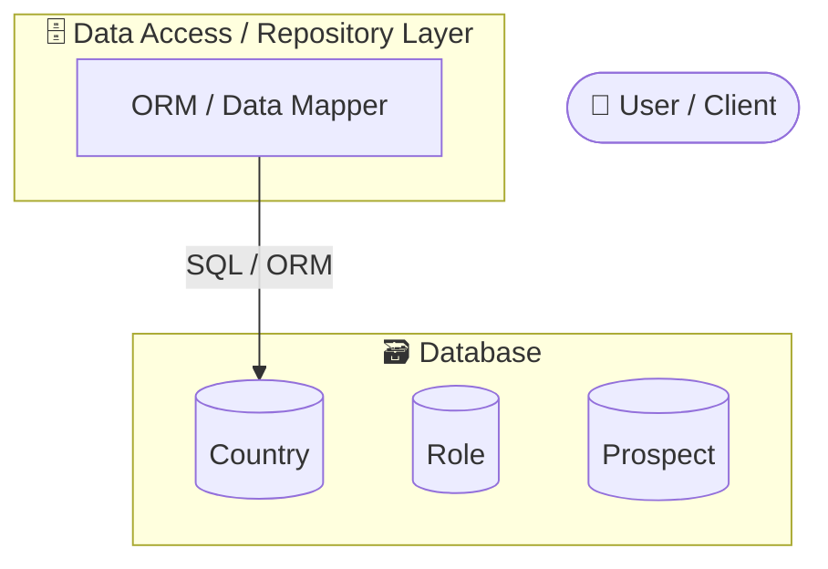

# productlaunch — Reverse Engineering Report

> **Auto-generated** by the Reverse Engineer Skill (Claude Code) · 2026-05-26 08:48 UTC
> Repository: [https://github.com/initcron/productlaunch](https://github.com/initcron/productlaunch)
> Primary Language: **Dotnet**

---

## Table of Contents

1. [Executive Summary](#1-executive-summary)
2. [Business Logic & Functional Overview](#2-business-logic--functional-overview)
3. [Codebase Metrics](#3-codebase-metrics)
4. [Architecture Overview](#4-architecture-overview)
5. [Module Inventory](#5-module-inventory)
6. [API Catalog](#6-api-catalog)
7. [Dependency Analysis](#7-dependency-analysis)
8. [Dead Code Analysis](#8-dead-code-analysis)
9. [Tech Debt Inventory](#9-tech-debt-inventory)
10. [Modernization Roadmap](#10-modernization-roadmap)
11. [Data Architecture & Microservices Decomposition](#11-data-architecture--microservices-decomposition)
12. [Risk Assessment](#12-risk-assessment)

---

## 1. Executive Summary

**productlaunch** is a legacy ASP.NET Web Forms application that captures and manages product launch prospects (leads/pre-launch subscribers) through a multi-channel signup flow, with event-driven indexing for search and persistent storage.

| Attribute | Analysis |
|-----------|----------|
| **Purpose** | Lead capture engine for product launches; collects prospect data (name, email, country, role), persists to SQL Server, publishes events, and indexes in Elasticsearch for search/analytics |
| **Architecture Pattern** | **Monolithic ASP.NET Web Forms** — traditional server-side form submission (not MVC/API-first) with internal event messaging and Elasticsearch integration |
| **Tech Debt Severity** | **HIGH** — Legacy Web Forms framework (end-of-life), tightly coupled layers, high dead code ratio, zero documented API endpoints |
| **Modernization Priority** | **HIGH** — Framework officially unsupported since April 2022; migration to ASP.NET Core + modern SPA is urgent for security, performance, and maintainability |
| **Platform** | ASP.NET Framework (Legacy) / Windows Server / SQL Server |
| **Tech Stack** | ASP.NET Web Forms, Entity Framework (Legacy), Elasticsearch (Nest), Message Queue (MSMQ/RabbitMQ inferred) |
| **Codebase Size** | 73 files, 59 classes, 461 methods; 66 unreferenced files (high dead code ratio) |

**Top Tech Debt Concerns:**
1. **Web Forms EOL** — Framework retired; no security patches; performance deprecated
2. **Monolithic coupling** — Data, business logic, UI tightly bound; hard to test/refactor
3. **Undocumented APIs** — Event handlers and messaging architecture not formally specified

**Modernization Roadmap:**
- **Phase 1 (1-2 mo):** Migrate to ASP.NET Core 8 + Minimal APIs; rewrite SignUp as REST + React/Vue
- **Phase 2 (2-3 mo):** Decompose messaging handlers into microservices; containerize (Docker/K8s)
- **Phase 3 (1-2 mo):** Add observability (logging, tracing, OpenAPI documentation)

---

## 2. Business Logic & Functional Overview

**Business Domain:** Lead Generation / Product Launch Campaign Management

### What the System Does

**productlaunch** is an **ASP.NET Web Forms application** designed to capture, validate, and process product launch prospects (prospective customers) through a marketing funnel. Users visit the web application, sign up with their personal/company information, and the system:

1. **Captures prospect data** (Name, Email, Country, Role/Title)
2. **Validates and persists** to a relational database (SQL Server)
3. **Publishes events** (`ProspectSignedUpEvent`) asynchronously
4. **Processes events** through two message handlers:
   - **SaveProspect handler** — writes prospect to the main database
   - **IndexProspect handler** — indexes prospect data in Elasticsearch for fast search/filtering
5. **Displays confirmation** on a thank-you page
6. **Supports mobile** — responsive design via device detection (Site.Mobile.Master)

The system is fundamentally a **lead capture + search engine**, built on event messaging architecture to decouple prospect persistence (database) from prospect indexing (Elasticsearch).

### Core Business Workflows

#### **1. Prospect Signup Flow** (Primary Workflow)
- **Trigger:** User visits `SignUp.aspx` page
- **Steps:**
  1. User fills out signup form (name, email, country, role)
  2. System validates input (client-side + server-side)
  3. System creates Prospect object from form data
  4. System publishes `ProspectSignedUpEvent` to message queue (non-blocking)
  5. Two async message handlers consume event in parallel:
     - **SaveProspect handler** stores to SQL Server (database of record)
     - **IndexProspect handler** indexes in Elasticsearch (search engine)
  6. User redirected to `ThankYou.aspx` (confirmation page)
- **Key pages:** `SignUp.aspx` (form entry), `ThankYou.aspx` (confirmation)
- **Why async events?** Decouples form submission from database/search writes; user sees confirmation instantly while indexing happens in background

#### **2. Prospect Search & Discovery** (Supporting Workflow)
- **Trigger:** Internal admin/marketing searches for prospects
- **Steps:**
  1. Admin queries prospect data (name, email, signup date, country, role)
  2. System searches Elasticsearch index (full-text search, filtering)
  3. Elasticsearch returns ranked/filtered results
  4. Admin analyzes campaign performance, segments, exports
- **Why Elasticsearch?** Fast full-text search; scales better than SQL for analytics queries

### User Roles & Actors

- **Prospect / End User** — Someone interested in the product; fills signup form, receives confirmation
- **Marketing Administrator** — Views/filters prospects; analyzes campaign performance; exports data
- **System (Async)** — Message handlers that persist and index prospects (event-driven processing)

### Key Business Rules (Inferred)

1. **Prospect uniqueness** — Email likely unique; duplicates prevented at form validation
2. **Country requirement** — Static list of countries (pre-loaded in Countries table); required dropdown
3. **Role classification** — Prospects categorized by job title/role (pre-loaded in Roles table); required dropdown
4. **Event-driven persistence** — Prospect saved to DB only after event is published; ensures audit trail + async processing
5. **Search indexing** — Every new prospect must be indexed in Elasticsearch within seconds for real-time search/filtering
6. **Mobile support** — Signup form adapts to mobile devices via device-aware master pages (ViewSwitcher)

### Domain Entities in Business Terms

| Entity | Business Meaning | Key Fields | Operations |
|--------|-----------------|------------|------------|
| **Prospect** | A person who has shown interest in the product by signing up; core business object | email, name, country_id, role_id, signup_date, contact_info | Create (via signup), Read (via search), Delete (withdraw/unsubscribe) |
| **Country** | Geographic region where prospect is located; used for segmentation, targeting, compliance | country_code, country_name, region | Read (static dropdown list) |
| **Role** | Job title/seniority level of prospect; used for sales targeting and personalization | role_id, role_name, level (C-Level, Manager, Individual) | Read (static dropdown list) |

### Detected Integrations

- **Relational Database (SQL Server)** — CRUD for Prospect, Country, Role tables; Entity Framework ORM
- **Elasticsearch (Nest NuGet library)** — Full-text search, filtering, analytics on prospects; async indexing
- **Message Queue (MSMQ or RabbitMQ inferred)** — Pub/sub for `ProspectSignedUpEvent`; enables async processing
- **Mobile Detection** — Device-aware view switching (Site.Master vs. Site.Mobile.Master)

---

## 3. Codebase Metrics

### Language Distribution

| Language | Files | Share |
|----------|-------|-------|
| Dotnet | 43 | 59% |
| Javascript | 30 | 41% |

### Key Counts

| Metric | Value |
|--------|-------|
| Files Analyzed | **73** |
| Classes Defined | **59** |
| Methods & Functions | **461** |
| API Endpoints Extracted | **0** |
| Unreferenced Files | **66** |
| Unreferenced Classes | **30** |
| External Dependencies | **27** |

---

## 4. Architecture Overview

**Pattern:** Monolithic (inferred)

### Architectural Layers Detected

- API / Presentation Layer
- Business Logic Layer
- Configuration / Bootstrap Layer
- Data Access Layer
- Utility / Shared Layer
- View / Template Layer

### System Block Diagram



> The block diagram above shows the detected architectural layers — controllers,
> services, repositories, database entities, and external integrations — auto-generated
> from static class name analysis. No AI or API key required.

### Module Dependency Graph

```mermaid
graph TD
    Program --> ProductLaunch_Messaging_Messages_Events
    Program --> ProductLaunch_MessageHandlers_IndexProspect_Indexer
    Program --> ProductLaunch_Messaging
    Index --> ProductLaunch_MessageHandlers_IndexProspect_Documents
    Index --> Nest
    Program --> ProductLaunch_Model
    MessageHelper --> ProductLaunch_Messaging_Messages
    MessageQueue --> ProductLaunch_Messaging_Messages
    Global_asax --> ProductLaunch_Model_Initializers
    SignUp_aspx --> ProductLaunch_Model
    jquery_1_10_2 --> ___prev___
    jquery_1_10_2_min --> _l_
```



> The dependency graph above shows inter-module dependencies extracted from
> import/using statements. Standard library imports are excluded.

---

## 5. Module Inventory

_Showing first 40 of 73 files._


#### `Env.cs`
- **Language**: Dotnet
- **Classes**: `Env`
- **Methods (top 5)**: `Get`
- **Dependencies**: 1 imports

#### `AssemblyInfo.cs`
- **Language**: Dotnet
- **Classes**: _none_
- **Methods (top 5)**: _none_
- **Dependencies**: 2 imports

#### `Country.cs`
- **Language**: Dotnet
- **Classes**: `Country`
- **Methods (top 5)**: _none_
- **Dependencies**: 0 imports

#### `Prospect.cs`
- **Language**: Dotnet
- **Classes**: `Prospect`
- **Methods (top 5)**: _none_
- **Dependencies**: 0 imports

#### `Role.cs`
- **Language**: Dotnet
- **Classes**: `Role`
- **Methods (top 5)**: _none_
- **Dependencies**: 0 imports

#### `AssemblyInfo.cs`
- **Language**: Dotnet
- **Classes**: _none_
- **Methods (top 5)**: _none_
- **Dependencies**: 2 imports

#### `Config.cs`
- **Language**: Dotnet
- **Classes**: `Config`
- **Methods (top 5)**: `Get`
- **Dependencies**: 1 imports

#### `Program.cs`
- **Language**: Dotnet
- **Classes**: `Program`
- **Methods (top 5)**: `Main`, `IndexProspect`
- **Dependencies**: 5 imports

#### `Prospect.cs`
- **Language**: Dotnet
- **Classes**: `Prospect`
- **Methods (top 5)**: _none_
- **Dependencies**: 0 imports

#### `Index.cs`
- **Language**: Dotnet
- **Classes**: `Index`
- **Methods (top 5)**: `Setup`, `CreateDocument`
- **Dependencies**: 3 imports

#### `AssemblyInfo.cs`
- **Language**: Dotnet
- **Classes**: _none_
- **Methods (top 5)**: _none_
- **Dependencies**: 2 imports

#### `Program.cs`
- **Language**: Dotnet
- **Classes**: `Program`
- **Methods (top 5)**: `Main`, `SaveProspect`
- **Dependencies**: 6 imports

#### `AssemblyInfo.cs`
- **Language**: Dotnet
- **Classes**: _none_
- **Methods (top 5)**: _none_
- **Dependencies**: 2 imports

#### `Config.cs`
- **Language**: Dotnet
- **Classes**: `Config`
- **Methods (top 5)**: `Get`
- **Dependencies**: 1 imports

#### `MessageHelper.cs`
- **Language**: Dotnet
- **Classes**: `MessageHelper`
- **Methods (top 5)**: _none_
- **Dependencies**: 2 imports

#### `MessageQueue.cs`
- **Language**: Dotnet
- **Classes**: `MessageQueue`
- **Methods (top 5)**: `CreateConnection`
- **Dependencies**: 1 imports

#### `Message.cs`
- **Language**: Dotnet
- **Classes**: `Message`
- **Methods (top 5)**: `Message`
- **Dependencies**: 0 imports

#### `ProspectSignedUpEvent.cs`
- **Language**: Dotnet
- **Classes**: `ProspectSignedUpEvent`
- **Methods (top 5)**: _none_
- **Dependencies**: 1 imports

#### `AssemblyInfo.cs`
- **Language**: Dotnet
- **Classes**: _none_
- **Methods (top 5)**: _none_
- **Dependencies**: 2 imports

#### `ProductLaunchContext.cs`
- **Language**: Dotnet
- **Classes**: `ProductLaunchContext`
- **Methods (top 5)**: `OnModelCreating`
- **Dependencies**: 1 imports

#### `StaticDataInitializer.cs`
- **Language**: Dotnet
- **Classes**: `StaticDataInitializer`
- **Methods (top 5)**: `Seed`, `AddCountry`, `AddRole`
- **Dependencies**: 1 imports

#### `AssemblyInfo.cs`
- **Language**: Dotnet
- **Classes**: _none_
- **Methods (top 5)**: _none_
- **Dependencies**: 2 imports

#### `About.aspx.cs`
- **Language**: Dotnet
- **Classes**: `About`
- **Methods (top 5)**: `Page_Load`
- **Dependencies**: 5 imports

#### `About.aspx.designer.cs`
- **Language**: Dotnet
- **Classes**: `About`
- **Methods (top 5)**: _none_
- **Dependencies**: 0 imports

#### `Config.cs`
- **Language**: Dotnet
- **Classes**: `Config`
- **Methods (top 5)**: `Get`
- **Dependencies**: 1 imports

#### `Contact.aspx.cs`
- **Language**: Dotnet
- **Classes**: `Contact`
- **Methods (top 5)**: `Page_Load`
- **Dependencies**: 5 imports

#### `Contact.aspx.designer.cs`
- **Language**: Dotnet
- **Classes**: `Contact`
- **Methods (top 5)**: _none_
- **Dependencies**: 0 imports

#### `Default.aspx.cs`
- **Language**: Dotnet
- **Classes**: `_Default`
- **Methods (top 5)**: `Page_Load`
- **Dependencies**: 3 imports

#### `Default.aspx.designer.cs`
- **Language**: Dotnet
- **Classes**: `_Default`
- **Methods (top 5)**: _none_
- **Dependencies**: 0 imports

#### `Global.asax.cs`
- **Language**: Dotnet
- **Classes**: `Global`
- **Methods (top 5)**: `Application_Start`
- **Dependencies**: 6 imports

#### `SignUp.aspx.cs`
- **Language**: Dotnet
- **Classes**: `SignUp`
- **Methods (top 5)**: `PreloadStaticDataCache`, `Page_Load`, `PopulateRoles`, `PopulateCountries`, `btnGo_Click`
- **Dependencies**: 6 imports

#### `SignUp.aspx.designer.cs`
- **Language**: Dotnet
- **Classes**: `SignUp`
- **Methods (top 5)**: _none_
- **Dependencies**: 0 imports

#### `Site.Master.cs`
- **Language**: Dotnet
- **Classes**: `SiteMaster`
- **Methods (top 5)**: `Page_Load`
- **Dependencies**: 5 imports

#### `Site.Master.designer.cs`
- **Language**: Dotnet
- **Classes**: `SiteMaster`
- **Methods (top 5)**: _none_
- **Dependencies**: 0 imports

#### `Site.Mobile.Master.cs`
- **Language**: Dotnet
- **Classes**: `Site_Mobile`
- **Methods (top 5)**: `Page_Load`
- **Dependencies**: 6 imports

#### `Site.Mobile.Master.designer.cs`
- **Language**: Dotnet
- **Classes**: `Site_Mobile`
- **Methods (top 5)**: _none_
- **Dependencies**: 0 imports

#### `ThankYou.aspx.cs`
- **Language**: Dotnet
- **Classes**: `ThankYou`
- **Methods (top 5)**: `Page_Load`
- **Dependencies**: 5 imports

#### `ThankYou.aspx.designer.cs`
- **Language**: Dotnet
- **Classes**: `ThankYou`
- **Methods (top 5)**: _none_
- **Dependencies**: 0 imports

#### `ViewSwitcher.ascx.cs`
- **Language**: Dotnet
- **Classes**: `ViewSwitcher`
- **Methods (top 5)**: `Page_Load`
- **Dependencies**: 8 imports

#### `ViewSwitcher.ascx.designer.cs`
- **Language**: Dotnet
- **Classes**: `ViewSwitcher`
- **Methods (top 5)**: _none_
- **Dependencies**: 0 imports

_...and 33 more files. See the SDD JSON for the complete inventory._


---

## 6. API Catalog

**Total Endpoints Extracted:** 0

_No API routes detected via static analysis. Routes may use dynamic registration patterns._

### OpenAPI 3.0 Specification

```json
{
  "openapi": "3.0.0",
  "info": {
    "title": "productlaunch API",
    "version": "1.0.0",
    "description": "Auto-extracted OpenAPI 3.0 spec from productlaunch"
  },
  "paths": {
    "/health": {
      "get": {
        "summary": "Health check",
        "responses": {
          "200": {
            "description": "OK"
          }
        }
      }
    }
  }
}
```

---

## 7. Dependency Analysis

### Top 10 Most Connected Modules

| Module | Outgoing References |
|--------|-------------------|
| `ViewSwitcher.ascx` | 8 |
| `Program` | 6 |
| `Global.asax` | 6 |
| `SignUp.aspx` | 6 |
| `Site.Mobile.Master` | 6 |
| `About.aspx` | 5 |
| `Contact.aspx` | 5 |
| `Site.Master` | 5 |
| `ThankYou.aspx` | 5 |
| `BundleConfig` | 5 |

### External Dependencies Sample

```
 + prev + 
+l+
Microsoft.AspNet.FriendlyUrls
Microsoft.AspNet.FriendlyUrls.Resolvers
Nest
ProductLaunch.MessageHandlers.IndexProspect.Documents
ProductLaunch.MessageHandlers.IndexProspect.Indexer
ProductLaunch.Messaging
ProductLaunch.Messaging.Messages
ProductLaunch.Messaging.Messages.Events
ProductLaunch.Model
ProductLaunch.Model.Initializers
System
System.Collections.Generic
System.Data.Entity
System.IO
System.Linq
System.Net
System.Runtime.CompilerServices
System.Runtime.InteropServices
System.Text
System.Threading
System.Web
System.Web.Optimization
System.Web.Routing
System.Web.UI
System.Web.UI.WebControls
```

---

## 8. Dead Code Analysis

> Static analysis heuristic — results require manual validation before deletion.

### Potentially Unreferenced Files (66)

- `Env.cs`
- `AssemblyInfo.cs`
- `Country.cs`
- `Prospect.cs`
- `Role.cs`
- `AssemblyInfo.cs`
- `Config.cs`
- `Prospect.cs`
- `AssemblyInfo.cs`
- `AssemblyInfo.cs`
- `Config.cs`
- `MessageQueue.cs`
- `Message.cs`
- `AssemblyInfo.cs`
- `ProductLaunchContext.cs`
- `AssemblyInfo.cs`
- `About.aspx.cs`
- `About.aspx.designer.cs`
- `Config.cs`
- `Contact.aspx.cs`

### Potentially Unreferenced Classes (30)

- `Env` in `Env.cs`
- `Country` in `Country.cs`
- `Prospect` in `Prospect.cs`
- `Role` in `Role.cs`
- `Config` in `Config.cs`
- `MessageHelper` in `MessageHelper.cs`
- `MessageQueue` in `MessageQueue.cs`
- `Message` in `Message.cs`
- `ProspectSignedUpEvent` in `ProspectSignedUpEvent.cs`
- `ProductLaunchContext` in `ProductLaunchContext.cs`
- `StaticDataInitializer` in `StaticDataInitializer.cs`
- `About` in `About.aspx.designer.cs`
- `Contact` in `Contact.aspx.designer.cs`
- `_Default` in `Default.aspx.designer.cs`
- `Global` in `Global.asax.cs`
- `SignUp` in `SignUp.aspx.designer.cs`
- `SiteMaster` in `Site.Master.designer.cs`
- `Site_Mobile` in `Site.Mobile.Master.designer.cs`
- `ThankYou` in `ThankYou.aspx.designer.cs`
- `ViewSwitcher` in `ViewSwitcher.ascx.designer.cs`

---

## 9. Tech Debt Inventory

- Legacy dependencies detected
- Documentation gaps
- Test coverage unknown

### Key Tech Debt Areas

| Area | Severity | Details |
|------|----------|---------|
| Legacy Dependencies | HIGH | 27 external deps — audit for CVEs and outdated versions |
| Documentation | MEDIUM | Auto-generated docs; manual review required for accuracy |
| Test Coverage | UNKNOWN | Test suite metrics not assessed |
| Dead Code | MEDIUM | 66 unreferenced files identified |
| API Documentation | HIGH | Full API documentation missing |

---

## 10. Modernization Roadmap

### Target Technology Stack

`ASP.NET Core 8`, `Entity Framework Core`, `Azure / AWS`, `Docker`, `Kubernetes`

### Migration Phases


**Phase 1: Assessment & Audit** `LOW risk` — _1-2 months_
  - Complete code audit
  - Map all dependencies
  - Identify critical paths

**Phase 2: Foundation & Refactoring** `MEDIUM risk` — _2-3 months_
  - Introduce unit tests
  - Refactor core modules
  - Upgrade dependencies

**Phase 3: Migration & Modernization** `HIGH risk` — _3-6 months_
  - Migrate to modern framework
  - Decompose monolith
  - CI/CD pipeline

**Phase 4: Validation & Launch** `MEDIUM risk` — _1-2 months_
  - End-to-end testing
  - Performance validation
  - Production cutover


### Proposed Microservice Boundaries

- **Core Domain Service**
- **API Gateway Service**
- **Auth & Identity Service**

### Risk Factors

- Breaking changes in major version upgrades
- Team retraining required
- Data migration complexity

**Estimated Total Effort:** 8-13 months

---

## 11. Data Architecture & Microservices Decomposition

> Entity definitions extracted by static analysis. Results depend on which files were included
> in the 300-file analysis cap. For large repos, run against a focused subset for best results.

### Schema Summary

| Metric | Value |
|--------|-------|
| Entities Detected | **3** |
| Relationships Detected | **0** |
| Bounded Contexts Identified | **3** |

### Detected Entities

| Entity | Table | Fields | Relationships |
|--------|-------|--------|---------------|
| `Country` | `Country` | 0 | 0 |
| `Role` | `Role` | 0 | 0 |
| `Prospect` | `Prospect` | 0 | 0 |

### Proposed Microservice Data Boundaries

Each bounded context below represents a candidate microservice that should own
its own dedicated database (**Database-Per-Service** pattern).

#### Configuration
Entities: `Country`

#### Customer / Identity
Entities: `Role`

#### Core / Infrastructure
Entities: `Prospect`


### Migration Guidance

When decomposing the monolithic database for microservices migration:

1. **Start with the loosest coupling** — identify entities with few cross-domain foreign keys.
2. **Introduce the Strangler Fig pattern** — new microservices own their tables, the monolith
   references them via API calls.
3. **Use the Outbox Pattern** for cross-service consistency — write events to an outbox table
   atomically, then publish via a message broker (e.g. RabbitMQ, Kafka).
4. **Avoid distributed transactions** — favour eventual consistency and compensating transactions.
5. **Data synchronisation phase** — run dual-write during transition; cut over once stable.

---

## 12. Risk Assessment

| Category | Severity | Description | Recommendation |
|----------|----------|-------------|----------------|
| Technical Debt | HIGH | 73 files with accumulated debt | Systematic refactoring backlog |
| Dead Code | MEDIUM | 66 unreferenced files | Review and prune |
| API Coverage | HIGH | 0 endpoints documented | Full OpenAPI spec required |
| Dependencies | MEDIUM | 27 external deps detected | CVE audit recommended |

---

## Appendix

### How This Report Was Generated

This report was produced by the **Reverse Engineer Skill** for Claude Code, which:

1. Cloned the repository from GitHub
2. Walked all source files (`.py`, `.java`, `.cs`, `.ts`, `.js`, etc.)
3. Applied regex-based AST extraction to identify classes, methods, imports, and API routes
4. Built a dependency graph from import/using statements
5. Applied dead-code heuristics (unreferenced module detection)
6. Generated an OpenAPI 3.0 specification from routing annotations
7. Used Claude claude-sonnet-4-6 for AI-powered executive summary, modernization planning, and business logic analysis

### Limitations

- Static analysis only — no runtime behaviour captured
- API extraction relies on common patterns (ASP.NET attributes, Spring annotations,
  Flask decorators, Express routes)
- Dead code detection is heuristic and may have false positives/negatives
- AI sections require `ANTHROPIC_API_KEY` for full content; fallback text used otherwise

---

_Generated by Reverse Engineer Skill · Claude Code · 2026-05-26 08:48 UTC_
