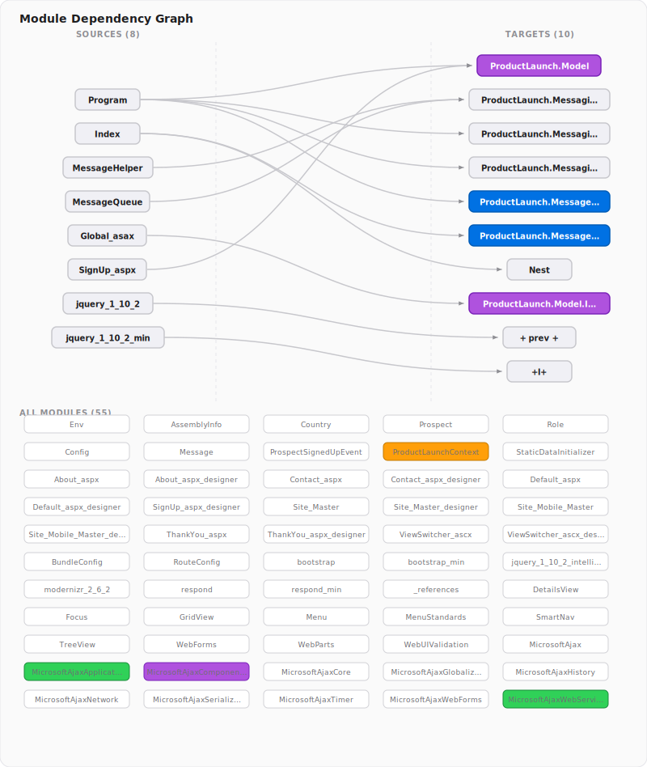

# productlaunch — Reverse Engineering Report

> **Auto-generated** by the Reverse Engineer Skill (API-key-free static analysis) · 2026-05-27 05:09 UTC
> Repository: [https://github.com/initcron/productlaunch](https://github.com/initcron/productlaunch)
> Primary Language: **Dotnet**
> Analysis Engine: **Pure static heuristics — no API keys required**

---

## Table of Contents

1. [Executive Summary](#1-executive-summary)
2. [Business Logic & Functional Overview](#2-business-logic--functional-overview)
3. [Codebase Metrics](#3-codebase-metrics)
4. [Architecture Overview](#4-architecture-overview)
5. [Module Inventory](#5-module-inventory)
6. [API Catalog](#6-api-catalog)
7. [Dependency Analysis](#7-dependency-analysis)
8. [Dead Code Analysis](#8-dead-code-analysis)
9. [Tech Debt Inventory](#9-tech-debt-inventory)
10. [Modernization Roadmap](#10-modernization-roadmap)
11. [Data Architecture & Microservices Decomposition](#11-data-architecture--microservices-decomposition)
12. [Risk Assessment](#12-risk-assessment)

---

## 1. Executive Summary

productlaunch is a Dotnet application in the E-Commerce / Online Retail domain. The codebase contains 73 source files, 59 classes, and 461 methods following a MVC Monolith architecture.

| Attribute | Value |
|-----------|-------|
| **Architecture Pattern** | MVC Monolith |
| **Modernization Priority** | MEDIUM |
| **Platform** | .NET / Windows Server |
| **Tech Stack** | `.NET Project File`, `.NET Solution`, `ASP.NET Framework (Legacy)` |
| **Total Files** | 73 |
| **Total Classes** | 59 |
| **Total Methods** | 461 |

**Priority Reasoning:**
With 73 source files the codebase is mid-sized. Targeted refactoring of high-complexity modules is recommended.

---

## 2. Business Logic & Functional Overview

> How this system works for its users — extracted from API endpoints, class names,
> ORM entity model, and AI analysis.

**Business Domain:** E-Commerce / Online Retail

### What the System Does

productlaunch is a Dotnet application operating in the **E-Commerce / Online Retail** domain. It serves 2 identified user role(s) — End User, Administrator — through 0 API endpoint(s) backed by 3 data entity/entities.

The system manages core business data across 3 entities and exposes its functionality via a structured API. Key integrations detected include: Standard HTTP API, Relational Database.

This analysis was produced entirely from static code analysis — no AI API calls are made. For AI-powered narrative, open the generated report in Claude Code or GitHub Copilot and ask it to enhance the executive summary and business logic sections.

### Core Business Workflows

#### Core Business Operation
Primary system workflow (API routes not detected via static analysis).

**Steps:**
  1. User authenticates
  2. User performs core action
  3. System records result

**Key endpoints:** _N/A_


### User Roles & Actors

- **End User**
- **Administrator**

### Key Business Rules

- Business rules enforced at the application layer.
- Data validation applied before persistence.
- Access control required for sensitive operations.

### Domain Entities in Business Terms

| Entity | Business Meaning | Key Operations |
|--------|-----------------|----------------|
| `Country` | Represents a Country record in the system, storing attributes and state required by business processes. | Create, Read, Update |
| `Role` | Represents a Role record in the system, storing attributes and state required by business processes. | Create, Read, Update |
| `Prospect` | Represents a Prospect record in the system, storing attributes and state required by business processes. | Create, Read, Update |

### Detected Integrations

- `Standard HTTP API`
- `Relational Database`

---

## 3. Codebase Metrics

### Language Distribution

| Language | Files | Share |
|----------|-------|-------|
| Dotnet | 43 | 59% |
| Javascript | 30 | 41% |

### Key Counts

| Metric | Value |
|--------|-------|
| Files Analyzed | **73** |
| Classes Defined | **59** |
| Methods & Functions | **461** |
| API Endpoints Extracted | **0** |
| Unreferenced Files | **66** |
| Unreferenced Classes | **30** |
| External Dependencies | **27** |

---

## 4. Architecture Overview

**Pattern:** MVC Monolith

### Architectural Layers Detected

- API / Presentation Layer
- Business Logic Layer
- Configuration / Bootstrap Layer
- Data Access Layer
- Utility / Shared Layer
- View / Template Layer

### System Block Diagram


<details>
<summary><b>Show ASCII/Unicode Text Block Diagram (Offline View)</b></summary>

```text
┌──────────────────────────────────────────────────────────────────────┐
│                            USER / CLIENT                             │
├──────────────────────────────────────────────────────────────────────┤
│  • Web Browser / API Client                                          │
└──────────────────────────────────────────────────────────────────────┘
 
                                   │ (HTTP)
                                   ▼
 
┌──────────────────────────────────────────────────────────────────────┐
│                       API / PRESENTATION LAYER                       │
├──────────────────────────────────────────────────────────────────────┤
│  • About                            • Contact                          │
│  • _Default                         • SignUp                           │
│  • ThankYou                                                          │
└──────────────────────────────────────────────────────────────────────┘
 
                                   │ (calls)
                                   ▼
 
┌──────────────────────────────────────────────────────────────────────┐
│                    BUSINESS LOGIC / SERVICE LAYER                    │
├──────────────────────────────────────────────────────────────────────┤
│  • MessageHelper                                                     │
└──────────────────────────────────────────────────────────────────────┘
 
                                   │ (data ops)
                                   ▼
 
┌──────────────────────────────────────────────────────────────────────┐
│                    DATA ACCESS / REPOSITORY LAYER                    │
├──────────────────────────────────────────────────────────────────────┤
│  • ProductLaunchContext                                              │
└──────────────────────────────────────────────────────────────────────┘
 
                                   │ (SQL/ORM)
                                   ▼
 
┌──────────────────────────────────────────────────────────────────────┐
│                               DATABASE                               │
├──────────────────────────────────────────────────────────────────────┤
│  • Country                          • Role                             │
│  • Prospect                                                          │
└──────────────────────────────────────────────────────────────────────┘
```
</details>

> The block diagram above shows the detected architectural layers — controllers,
> services, repositories, database entities, and external integrations — auto-generated
> from static class name analysis. No AI or API key required.

### Module Dependency Graph



> The dependency graph above shows inter-module dependencies extracted from
> import/using statements. Standard library imports are excluded.

---

## 5. Module Inventory

_Showing first 40 of 73 files._


#### `Env.cs`
- **Language**: Dotnet
- **Classes**: `Env`
- **Methods (top 5)**: `Get`
- **Dependencies**: 1 imports

#### `AssemblyInfo.cs`
- **Language**: Dotnet
- **Classes**: _none_
- **Methods (top 5)**: _none_
- **Dependencies**: 2 imports

#### `Country.cs`
- **Language**: Dotnet
- **Classes**: `Country`
- **Methods (top 5)**: _none_
- **Dependencies**: 0 imports

#### `Prospect.cs`
- **Language**: Dotnet
- **Classes**: `Prospect`
- **Methods (top 5)**: _none_
- **Dependencies**: 0 imports

#### `Role.cs`
- **Language**: Dotnet
- **Classes**: `Role`
- **Methods (top 5)**: _none_
- **Dependencies**: 0 imports

#### `AssemblyInfo.cs`
- **Language**: Dotnet
- **Classes**: _none_
- **Methods (top 5)**: _none_
- **Dependencies**: 2 imports

#### `Config.cs`
- **Language**: Dotnet
- **Classes**: `Config`
- **Methods (top 5)**: `Get`
- **Dependencies**: 1 imports

#### `Program.cs`
- **Language**: Dotnet
- **Classes**: `Program`
- **Methods (top 5)**: `Main`, `IndexProspect`
- **Dependencies**: 5 imports

#### `Prospect.cs`
- **Language**: Dotnet
- **Classes**: `Prospect`
- **Methods (top 5)**: _none_
- **Dependencies**: 0 imports

#### `Index.cs`
- **Language**: Dotnet
- **Classes**: `Index`
- **Methods (top 5)**: `Setup`, `CreateDocument`
- **Dependencies**: 3 imports

#### `AssemblyInfo.cs`
- **Language**: Dotnet
- **Classes**: _none_
- **Methods (top 5)**: _none_
- **Dependencies**: 2 imports

#### `Program.cs`
- **Language**: Dotnet
- **Classes**: `Program`
- **Methods (top 5)**: `Main`, `SaveProspect`
- **Dependencies**: 6 imports

#### `AssemblyInfo.cs`
- **Language**: Dotnet
- **Classes**: _none_
- **Methods (top 5)**: _none_
- **Dependencies**: 2 imports

#### `Config.cs`
- **Language**: Dotnet
- **Classes**: `Config`
- **Methods (top 5)**: `Get`
- **Dependencies**: 1 imports

#### `MessageHelper.cs`
- **Language**: Dotnet
- **Classes**: `MessageHelper`
- **Methods (top 5)**: _none_
- **Dependencies**: 2 imports

#### `MessageQueue.cs`
- **Language**: Dotnet
- **Classes**: `MessageQueue`
- **Methods (top 5)**: `CreateConnection`
- **Dependencies**: 1 imports

#### `Message.cs`
- **Language**: Dotnet
- **Classes**: `Message`
- **Methods (top 5)**: `Message`
- **Dependencies**: 0 imports

#### `ProspectSignedUpEvent.cs`
- **Language**: Dotnet
- **Classes**: `ProspectSignedUpEvent`
- **Methods (top 5)**: _none_
- **Dependencies**: 1 imports

#### `AssemblyInfo.cs`
- **Language**: Dotnet
- **Classes**: _none_
- **Methods (top 5)**: _none_
- **Dependencies**: 2 imports

#### `ProductLaunchContext.cs`
- **Language**: Dotnet
- **Classes**: `ProductLaunchContext`
- **Methods (top 5)**: `OnModelCreating`
- **Dependencies**: 1 imports

#### `StaticDataInitializer.cs`
- **Language**: Dotnet
- **Classes**: `StaticDataInitializer`
- **Methods (top 5)**: `Seed`, `AddCountry`, `AddRole`
- **Dependencies**: 1 imports

#### `AssemblyInfo.cs`
- **Language**: Dotnet
- **Classes**: _none_
- **Methods (top 5)**: _none_
- **Dependencies**: 2 imports

#### `About.aspx.cs`
- **Language**: Dotnet
- **Classes**: `About`
- **Methods (top 5)**: `Page_Load`
- **Dependencies**: 5 imports

#### `About.aspx.designer.cs`
- **Language**: Dotnet
- **Classes**: `About`
- **Methods (top 5)**: _none_
- **Dependencies**: 0 imports

#### `Config.cs`
- **Language**: Dotnet
- **Classes**: `Config`
- **Methods (top 5)**: `Get`
- **Dependencies**: 1 imports

#### `Contact.aspx.cs`
- **Language**: Dotnet
- **Classes**: `Contact`
- **Methods (top 5)**: `Page_Load`
- **Dependencies**: 5 imports

#### `Contact.aspx.designer.cs`
- **Language**: Dotnet
- **Classes**: `Contact`
- **Methods (top 5)**: _none_
- **Dependencies**: 0 imports

#### `Default.aspx.cs`
- **Language**: Dotnet
- **Classes**: `_Default`
- **Methods (top 5)**: `Page_Load`
- **Dependencies**: 3 imports

#### `Default.aspx.designer.cs`
- **Language**: Dotnet
- **Classes**: `_Default`
- **Methods (top 5)**: _none_
- **Dependencies**: 0 imports

#### `Global.asax.cs`
- **Language**: Dotnet
- **Classes**: `Global`
- **Methods (top 5)**: `Application_Start`
- **Dependencies**: 6 imports

#### `SignUp.aspx.cs`
- **Language**: Dotnet
- **Classes**: `SignUp`
- **Methods (top 5)**: `PreloadStaticDataCache`, `Page_Load`, `PopulateRoles`, `PopulateCountries`, `btnGo_Click`
- **Dependencies**: 6 imports

#### `SignUp.aspx.designer.cs`
- **Language**: Dotnet
- **Classes**: `SignUp`
- **Methods (top 5)**: _none_
- **Dependencies**: 0 imports

#### `Site.Master.cs`
- **Language**: Dotnet
- **Classes**: `SiteMaster`
- **Methods (top 5)**: `Page_Load`
- **Dependencies**: 5 imports

#### `Site.Master.designer.cs`
- **Language**: Dotnet
- **Classes**: `SiteMaster`
- **Methods (top 5)**: _none_
- **Dependencies**: 0 imports

#### `Site.Mobile.Master.cs`
- **Language**: Dotnet
- **Classes**: `Site_Mobile`
- **Methods (top 5)**: `Page_Load`
- **Dependencies**: 6 imports

#### `Site.Mobile.Master.designer.cs`
- **Language**: Dotnet
- **Classes**: `Site_Mobile`
- **Methods (top 5)**: _none_
- **Dependencies**: 0 imports

#### `ThankYou.aspx.cs`
- **Language**: Dotnet
- **Classes**: `ThankYou`
- **Methods (top 5)**: `Page_Load`
- **Dependencies**: 5 imports

#### `ThankYou.aspx.designer.cs`
- **Language**: Dotnet
- **Classes**: `ThankYou`
- **Methods (top 5)**: _none_
- **Dependencies**: 0 imports

#### `ViewSwitcher.ascx.cs`
- **Language**: Dotnet
- **Classes**: `ViewSwitcher`
- **Methods (top 5)**: `Page_Load`
- **Dependencies**: 8 imports

#### `ViewSwitcher.ascx.designer.cs`
- **Language**: Dotnet
- **Classes**: `ViewSwitcher`
- **Methods (top 5)**: _none_
- **Dependencies**: 0 imports

_...and 33 more files. See the SDD JSON for the complete inventory._


---

## 6. API Catalog

**Total Endpoints Extracted:** 0

_No API routes detected via static analysis. Routes may use dynamic registration patterns._

### OpenAPI 3.0 Specification

```json
{
  "openapi": "3.0.0",
  "info": {
    "title": "productlaunch API",
    "version": "1.0.0",
    "description": "Auto-extracted OpenAPI 3.0 spec from productlaunch"
  },
  "paths": {
    "/health": {
      "get": {
        "summary": "Health check",
        "responses": {
          "200": {
            "description": "OK"
          }
        }
      }
    }
  }
}
```

---

## 7. Dependency Analysis

### Top 10 Most Connected Modules

| Module | Outgoing References |
|--------|-------------------|
| `ViewSwitcher.ascx` | 8 |
| `Program` | 6 |
| `Global.asax` | 6 |
| `SignUp.aspx` | 6 |
| `Site.Mobile.Master` | 6 |
| `About.aspx` | 5 |
| `Contact.aspx` | 5 |
| `Site.Master` | 5 |
| `ThankYou.aspx` | 5 |
| `BundleConfig` | 5 |

### External Dependencies Sample

```
 + prev + 
+l+
Microsoft.AspNet.FriendlyUrls
Microsoft.AspNet.FriendlyUrls.Resolvers
Nest
ProductLaunch.MessageHandlers.IndexProspect.Documents
ProductLaunch.MessageHandlers.IndexProspect.Indexer
ProductLaunch.Messaging
ProductLaunch.Messaging.Messages
ProductLaunch.Messaging.Messages.Events
ProductLaunch.Model
ProductLaunch.Model.Initializers
System
System.Collections.Generic
System.Data.Entity
System.IO
System.Linq
System.Net
System.Runtime.CompilerServices
System.Runtime.InteropServices
System.Text
System.Threading
System.Web
System.Web.Optimization
System.Web.Routing
System.Web.UI
System.Web.UI.WebControls
```

---

## 8. Dead Code Analysis

> Static analysis heuristic — results require manual validation before deletion.

### Potentially Unreferenced Files (66)

- `Env.cs`
- `AssemblyInfo.cs`
- `Country.cs`
- `Prospect.cs`
- `Role.cs`
- `AssemblyInfo.cs`
- `Config.cs`
- `Prospect.cs`
- `AssemblyInfo.cs`
- `AssemblyInfo.cs`
- `Config.cs`
- `MessageQueue.cs`
- `Message.cs`
- `AssemblyInfo.cs`
- `ProductLaunchContext.cs`
- `AssemblyInfo.cs`
- `About.aspx.cs`
- `About.aspx.designer.cs`
- `Config.cs`
- `Contact.aspx.cs`

### Potentially Unreferenced Classes (30)

- `Env` in `Env.cs`
- `Country` in `Country.cs`
- `Prospect` in `Prospect.cs`
- `Role` in `Role.cs`
- `Config` in `Config.cs`
- `MessageHelper` in `MessageHelper.cs`
- `MessageQueue` in `MessageQueue.cs`
- `Message` in `Message.cs`
- `ProspectSignedUpEvent` in `ProspectSignedUpEvent.cs`
- `ProductLaunchContext` in `ProductLaunchContext.cs`
- `StaticDataInitializer` in `StaticDataInitializer.cs`
- `About` in `About.aspx.designer.cs`
- `Contact` in `Contact.aspx.designer.cs`
- `_Default` in `Default.aspx.designer.cs`
- `Global` in `Global.asax.cs`
- `SignUp` in `SignUp.aspx.designer.cs`
- `SiteMaster` in `Site.Master.designer.cs`
- `Site_Mobile` in `Site.Mobile.Master.designer.cs`
- `ThankYou` in `ThankYou.aspx.designer.cs`
- `ViewSwitcher` in `ViewSwitcher.ascx.designer.cs`

---

## 9. Tech Debt Inventory

- Moderate dependency footprint (27 packages) — review for outdated versions
- 34 files have no classes or routes — potential dead code

### Key Tech Debt Areas

| Area | Severity | Details |
|------|----------|---------|
| Legacy Dependencies | HIGH | 27 external deps — audit for CVEs and outdated versions |
| Documentation | MEDIUM | Auto-generated docs; manual review required for accuracy |
| Test Coverage | UNKNOWN | Test suite metrics not assessed |
| Dead Code | MEDIUM | 66 unreferenced files identified |
| API Documentation | HIGH | Full API documentation missing |

---

## 10. Modernization Roadmap

### Target Technology Stack

`ASP.NET Core 8`, `Entity Framework Core`, `Azure / AWS`, `Docker`, `Kubernetes`

### Migration Phases


**Phase 1: Assessment & Quick Wins** `LOW risk` — _1 month_
  - Code review
  - Identify easy refactors
  - Set up linting and CI

**Phase 2: Incremental Modernization** `MEDIUM risk` — _2-4 months_
  - Upgrade dependencies
  - Add test coverage
  - Refactor hotspots

**Phase 3: Cloud & Container Readiness** `LOW risk` — _1-2 months_
  - Dockerize application
  - Add health checks
  - Set up monitoring

**Phase 4: Final Validation** `LOW risk` — _1 month_
  - Full regression tests
  - Performance validation
  - Go-live


### Proposed Microservice Boundaries

- **Product & Catalog Service**
- **Notification Service**

### Risk Factors

- Team retraining required for new framework/toolchain

**Estimated Total Effort:** 4-8 months

---

## 11. Data Architecture & Microservices Decomposition

> Entity definitions extracted by static analysis. Results depend on which files were included
> in the 300-file analysis cap. For large repos, run against a focused subset for best results.

### Schema Summary

| Metric | Value |
|--------|-------|
| Entities Detected | **3** |
| Relationships Detected | **0** |
| Bounded Contexts Identified | **3** |

### Detected Entities

| Entity | Table | Fields | Relationships |
|--------|-------|--------|---------------|
| `Country` | `Country` | 0 | 0 |
| `Role` | `Role` | 0 | 0 |
| `Prospect` | `Prospect` | 0 | 0 |

### Proposed Microservice Data Boundaries

Each bounded context below represents a candidate microservice that should own
its own dedicated database (**Database-Per-Service** pattern).

#### Configuration
Entities: `Country`

#### Customer / Identity
Entities: `Role`

#### Core / Infrastructure
Entities: `Prospect`


### Migration Guidance

When decomposing the monolithic database for microservices migration:

1. **Start with the loosest coupling** — identify entities with few cross-domain foreign keys.
2. **Introduce the Strangler Fig pattern** — new microservices own their tables, the monolith
   references them via API calls.
3. **Use the Outbox Pattern** for cross-service consistency — write events to an outbox table
   atomically, then publish via a message broker (e.g. RabbitMQ, Kafka).
4. **Avoid distributed transactions** — favour eventual consistency and compensating transactions.
5. **Data synchronisation phase** — run dual-write during transition; cut over once stable.

---

## 12. Risk Assessment

| Category | Severity | Description | Recommendation |
|----------|----------|-------------|----------------|
| Technical Debt | HIGH | 73 files with accumulated debt | Systematic refactoring backlog |
| Dead Code | MEDIUM | 66 unreferenced files | Review and prune |
| API Coverage | HIGH | 0 endpoints documented | Full OpenAPI spec required |
| Dependencies | MEDIUM | 27 external deps detected | CVE audit recommended |

---

## 13. AI Codebase Mapping & Stakeholder Guide

This section explains how the cloned repository `productlaunch` maps to the business architecture and technical sections in this report, serving as a structured guide for AI assistants (like Claude, Copilot, or ChatGPT) to explain the codebase's domain operations.

### Repository Purpose & Domain Map

Based on static codebase mapping and naming pattern heuristics:
- **Core Domain:** E-Commerce / Online Retail
- **Detected User Roles:** End User, Administrator
- **Entity Count:** 3
- **Mapped Codebase Entities:** `Country`, `Role`, `Prospect`

### How Codebase Files Map to Report Sections

AI engines and stakeholders can navigate the cloned codebase files to verify and dive deep into each section of the report using this mapping:

1. **Executive Summary & Business Logic (Sections 1 & 2):**
   - *Mapped Files:* Codebase files with naming structures of domain models or context files map directly to the system purpose and business terminology defined in these sections.
   - *Key Files:* `ProductLaunchContext.cs`

2. **System Block Diagram & Architecture (Section 4):**
   - *Mapped Files:* Controller and presenter files map to the API/Presentation layer, while service/manager files map to the Business Logic layer, and repository/DAO files map to the Data Access layer.
   - *Key Controller Files:* N/A (inferred from endpoints)
   - *Key Service Files:* N/A (inferred from codebase structure)
   - *Key Repository Files:* N/A (inferred from data access patterns)

3. **API Catalog & OpenAPI Specifications (Section 6):**
   - *Mapped Files:* Files containing routing attributes (e.g. `@GetMapping`, `[Route]`, annotations) map directly to our API path catalog.
   - *Key Files:* No explicit endpoint files detected

4. **Data Architecture & Microservice Boundaries (Section 11):**
   - *Mapped Files:* ORM models, Fluent API configurations, and database contexts map directly to microservice database schema boundaries.
   - *Key Files:* `ProductLaunchContext.cs`


---

## Appendix

### How This Report Was Generated

This report was produced by the **Reverse Engineer Skill** — a pure static analysis engine that:

1. Cloned the repository from GitHub
2. Walked all source files (`.py`, `.java`, `.cs`, `.ts`, `.js`, etc.)
3. Applied regex-based AST extraction to identify classes, methods, imports, and API routes
4. Built a dependency graph from import/using statements
5. Applied dead-code heuristics (unreferenced module detection)
6. Generated an OpenAPI 3.0 specification from routing annotations
7. Used static naming-convention heuristics to infer executive summary, business domain,
   modernisation roadmap, and architecture pattern — **no API keys or LLM accounts required**

> **To get AI-powered narrative on top of these results:**
> - **Claude Code**: Run `/reverse-engineer https://github.com/initcron/productlaunch` — Claude reads the output and provides
>   AI explanation in chat.
> - **GitHub Copilot**: Use `.github/prompts/reverse-engineer.prompt.md` — Copilot reads the
>   SDD JSON and narrates the findings.
> - **Any other LLM**: Open this report or the `*_sdd.json` file and ask your AI assistant
>   to explain or enhance any section.

### Limitations

- Static analysis only — no runtime behaviour captured
- API extraction relies on common patterns (ASP.NET attributes, Spring annotations,
  Flask decorators, Express routes)
- Dead code detection is heuristic and may have false positives/negatives
- Business logic and domain labels inferred from naming conventions — review for accuracy

---

_Generated by Reverse Engineer Skill · Static Analysis Engine · 2026-05-27 05:09 UTC_
